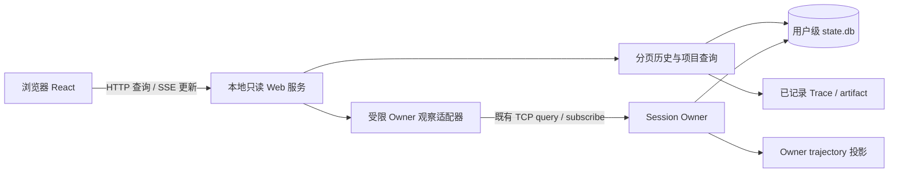

# Plan 15：项目运行数据 Web 展示

> 状态：in progress；W01–W06 已接线，`runledger web` 可启动；W07 已完成真实 CLI/HTTP/浏览器及规模验证；浏览器侧已拆为独立 workspace 包 `packages/collab-web`（§9.5）；全仓门禁与提交仍受阻。当前证据及限制见 §9。
> 目标：在浏览器按项目查看 RunLedger 的历史与当前执行，包括对话、工具、轨迹、用量、进程和已有 child 记录。
> 本计划是新增功能编排；Runtime 04/06、Trajectory 和用户级存储专题继续拥有各自合同。

## 1. 结论与范围

采用 **本地只读 Web 看板 + 薄 HTTP 桥 + 既有 Session Owner/存储查询**。参考 oh-my-pi collab-web 的组件和状态同步设计，不迁移其 relay、room key 或 pi-wire 数据模型。

用户流程：在终端执行 `runledger web` → 打开本机地址 → 选择项目 → 选择 Session → 查看对话、运行轨迹和统计。原 CLI/TUI 继续执行任务，浏览器实时观察；Owner 退出后仍可阅读已持久化历史。

首版覆盖：项目/会话目录、历史对话和工具卡片、执行状态、Run/Step/Call 轨迹、模型 Token/费用、工具结果详情、已有进程及 child 的只读详情。Plan 状态在当前领域合同稳定后接入，缺失能力显示“不可用”。

首版不提供 prompt、abort、审批、终端输入、恢复 Session、修改配置或多用户共享。浏览器只读由服务端操作白名单保证。远程协作与写操作另立阶段，不通过复制 collab 的 Composer 默认开启。

这里的“项目运行数据”指 RunLedger 执行项目任务时已经保存或发布的数据；不承诺应用自身的 CPU、内存、业务日志或服务健康监控。

## 2. 调查基线与参考映射

调查基线：RunLedger HEAD `82be1dfb7998d3a6a7fe384eea54d43c02a84927`；oh-my-pi HEAD `3b3a6dc9bbd85102ce19d0b1c11bf6870915f6ec`。RunLedger 工作树已有 Plan 模式等并行修改，本计划不以其尚未提交接口作为冻结依赖，也不修改这些文件。

### 2.1 collab-web 可借鉴内容

源码根：`oh-my-pi/packages/collab-web/`，以下均为相对该根的路径。

| 已查源码 | 实际机制 | RunLedger 采用方式 |
|---|---|---|
| `README.md`、`package.json` | React 静态 SPA，Bun 构建，pi-wire 共享合同 | React 展示层独立构建；合同改用 RunLedger browser-safe DTO |
| `src/lib/client.ts` | GuestClient 顺序应用 frame，稳定快照引用，subscribe/getSnapshot；连接状态、流式消息、activeTools | 实现 WebSessionStore；区分持久化事件与临时状态，重连重建快照 |
| `src/components/transcript/Transcript.tsx` | 消息、thinking 折叠、工具关联、跟随尾部滚动 | 移植展示结构与交互，按 RunLedger 消息/工具 ID 适配；增加长列表窗口化 |
| `src/tool-render/ToolView.tsx`、`registry.ts` | 工具 renderer 注册表和通用 fallback | 首批 bash/read/edit/write/search；未知工具安全文本显示 |
| `src/components/agents/AgentDrawer.tsx`、`src/lib/transcript-poll.ts` | child 历史增量读取；临时失败重试、终态错误停止 | 改用 Session/child ID 和有界游标；不读浏览器传入的任意文件路径 |
| `src/components/transcript/Markdown.tsx` | 转义原始 HTML、限制链接协议 | 保留安全语义，覆盖 Markdown/工具输出注入测试 |
| `src/lib/socket.ts`、`codec.ts`、`link.ts` | relay WebSocket、AES-GCM 与分享链接 | 首版本地部署无需搬入；浏览器到 HTTP 桥单独认证 |

参考移植时记录源 commit、文件、许可证和改动说明，保留 MIT attribution；不引入 oh-my-pi workspace 的运行时依赖。工具卡片只适配 RunLedger 实有工具，不复制整套无对应能力的 renderer。

### 2.2 RunLedger 现状与缺口

下列链接均为当前源码入口，属于调查证据，不代表 Web 功能已经存在。

| 数据/机制 | 现有入口 | 缺口与实施要求 |
|---|---|---|
| 项目与 Session 元数据 | [SessionCatalogRecord](../../src/storage/session-store/session-store.ts)、[CatalogRepository](../../src/storage/session-store/catalog-repository.ts) | 已有 workspaceId/repositoryId、标题、状态、时间、headSequence；listSessions 全量查询，需存储层分页与分组 |
| 历史事件与回执 | [SessionQueryHandler](../../src/runtime/session-runtime/query-handler.ts) | snapshot/timeline/receipts/recovery_status 已有；timeline 全量 replay 后 slice，receipts 全量返回，需有界范围查询 |
| 实时连接 | [client-transport](../../src/runtime/session-server/client-transport.ts)、[protocol](../../src/runtime/session-server/protocol.ts) | localhost TCP JSONL 与 authToken 握手，浏览器不能直接使用；需受限桥接适配器 |
| 事件订阅 | [subscription](../../src/runtime/session-server/subscription.ts)、[runtime-server](../../src/runtime/session-server/runtime-server.ts) | 有 cursor/ACK/replay/resync；广播路径 recentEvents 仍读取全部事件，需按序号范围读取；trajectory.changed 无持久化 sequence，idle recap 只发 driver |
| 轨迹与详情 | [trajectory DTO](../../src/runtime/contracts/trajectory.ts)、[TrajectoryService](../../src/runtime/trajectory/service.ts) | 已有分页、搜索、状态、耗时、Token/费用、详情可用性；服务由 Owner 持有，会创建/写入/重建缓存，不能直接让第二进程共同维护同一索引 |
| 用量语义 | [usage](../../src/runtime/usage/index.ts) | 已区分已知/未知及来源；项目聚合需定义去重，不能把 Run/Step/model 每层费用相加 |
| 对话投影 | [Timeline projector](../../src/tui/timeline/event-projector.ts)、[presentation](../../src/tui/presentation.ts) | 有纯投影和稳定行 ID；仍位于 TUI 目录并引用 TuiEvent，需抽出无 OpenTUI/Node 依赖的最小共享部分 |
| 历史读取 | [SessionDatabase](../../src/storage/session-store/database.ts) | 有 readOnly 选项，但 open 的 PRAGMA 路径可能尝试切换 journal mode；需只读打开验证，不启动 Owner、不迁移、不修复 authority |

数据 authority 仍为用户级 `state.db` 和已记录的 Trace/artifact；trajectory SQLite 是可重建投影。不新增项目 `.runledger/`，不复制真实凭据，不把数据库文件直接交给浏览器。

## 3. 页面与数据口径

| 页面 | 首版内容 | 关键行为 |
|---|---|---|
| 项目目录 | 展示名、Session 数、最后活动、可确认的在线数 | 默认 workspaceId 为项目分组；repositoryId 用作仓库关联，不自动合并不同 worktree；无身份记录单列 |
| 项目详情 | 分页 Session 列表、时间范围、状态筛选、累计用量 | 查询范围明确；统计显示 coverage/asOf，不把当前页面总和称为项目总量 |
| Session 对话 | 用户/助手消息、折叠 thinking、工具参数/结果、运行状态 | 默认末尾一页，向上加载；用户上滚后停止自动跟随，可跳回最新 |
| Session 轨迹 | Run → Step → model/tool/context/wait/attempt | 展示状态、耗时、TTFT、Token/费用、来源；无可靠父子关联的 receipt 单列，不猜测绑定 |
| 详情侧栏 | input/output 分页、错误、recording 健康与缺口 | not-recorded/unavailable/corrupt 分别显示；大文本按需读取 |
| 进程/child | 已有进程状态与输出、已有 child 状态及记录 | 遵循现有能力范围；不提供 stdin/kill/revive，不改变 child 默认关闭与单 child 限制 |

状态拆分为：持久化执行状态、Owner 连接状态、数据新鲜度。连接失败只显示“离线/数据可能滞后”，不得把最后一次 running 自动改为成功或失败。

用量聚合以唯一实际模型调用为单位；跨事件/Trace 去重，同一调用的重放或更新替换原 observation。fork 继承历史不重复计入项目新增消耗；重试产生的新调用计入。来源不完整时给出已知部分与缺失数，未知费用不写成 0，估算费用单独标记。无法建立可靠调用身份的历史不计入“完整总额”。

## 4. 数据链路与模块边界

目录现状：浏览器侧独立为 workspace 包 `packages/collab-web/`（`src/contracts` 为 web DTO/schema 出口，`src/**` 为 SPA，`index.html`/`app.css` 为静态壳，`scripts/build.ts` 打包到产品 `dist/web/assets`，`test/**` 为包内测试）；HTTP/认证/桥接适配器在 `src/web/`，属产品包 `runledger`；`src/storage/session-store/` 提供有界读接口。纯展示投影抽至框架无关模块，由 TUI/Web 共用；不要让浏览器 import CLI、SessionStore 或 OpenTUI。包边界与依赖方向见 §9.5。

### 4.1 活跃与历史 Session

- 活跃 Session：服务端按既有 owner 身份和握手验证连接，只调用允许的 query/subscribe/ACK；不 claim driver、不抢占、不自动 resume。需要审查现有客户端构造是否附带 claim，必要时新增独立 observer facade。
- 历史 Session：短只读事务读取 catalog/events/receipts；分页重建对话。缺失 DB/schema 不兼容/迁移中返回明确状态，Web 不执行恢复和迁移。
- 活跃轨迹通过 Owner 查询。离线轨迹复用纯 projector，在 Web 自有、可丢弃的临时索引中按需重建；不写 Owner 的 trajectory SQLite，也不直接构造 Owner TrajectoryService。设置每次扫描和总缓存配额、淘汰及关闭清理。Owner 恢复在线后切换数据源并使旧游标失效。
- 项目目录短周期检查 catalog revision；运行状态另外检查 head/已验证 Owner 状态，不能假定每次执行事件都会改变 catalog revision。只为可见 Session 维持实时观察；首页不连接所有 Owner。

### 4.2 拟定 HTTP 合同

所有 `/api/v1` 路由均为新增设计；完整 schema、错误与版本规则在 W01 冻结。

| 路由 | 语义 |
|---|---|
| `GET /api/v1/projects` | workspace 分组分页列表 |
| `GET /api/v1/projects/:id/sessions` | Session 分页、筛选 |
| `GET /api/v1/projects/:id/usage` | 带时间范围、来源、coverage 的去重聚合 |
| `GET /api/v1/sessions/:id/snapshot` | 有界首屏、连接状态、持久化 watermark |
| `GET /api/v1/sessions/:id/timeline` | before/after 游标分页；限制条数与字节 |
| `GET /api/v1/sessions/:id/trajectory` | 复用轨迹 page/search 语义 |
| `GET /api/v1/sessions/:id/trajectory/:recordId/detail` | input/output 按需分页 |
| `GET /api/v1/sessions/:id/events` | SSE 持久化变更、失效通知、连接状态 |
| `GET /api/v1/sessions/:id/processes`、`.../children` | 显式只读适配，未装配时 unavailable |

公开 DTO 仅包含已审查字段、opaque ID/digest/locator；内部 sourceWorkspaceLocator、端口、Owner token、配置和原始整行 JSON 不透传。Artifact 访问必须验证归属 Session，不能凭 digest 读取其他 Session 的内容。

### 4.3 快照、增量与断线恢复

1. 在一致读视图中读取 snapshot 与其覆盖的 sequence=S；随后订阅 S 之后的事件。已发生的变化通过有界 replay 补齐，不能采用“先快照再只听新消息”。
2. 浏览器以 sessionId + sequence 去重；传输游标还绑定 Owner generation 和数据源 epoch。Owner 更换、历史源切换或游标超窗返回 resync_required，取消旧请求并重新获取快照。
3. trajectory.changed 等无序号通知仅触发节流查询，不推进持久化 cursor；不同日志序号不能混用。逐 Token 展示要先验证 observer 实际收到的协议，未提供时显示已提交消息和执行中状态，不伪造实时全文。
4. Web 到 Owner 的 ACK 与浏览器恢复游标分开。桥只在有界队列接纳后 ACK；浏览器慢时主动断开并要求补读，不能无限累积或声称浏览器已经消费。
5. SSE 心跳、指数退避和 AbortController 清理；断线保留已显示内容并标记陈旧。目录首版可用 2 秒 revision 轮询，后台页退避。

## 5. 部署、安全与性能

- `runledger web` 显式启动前台服务，默认只绑定 `127.0.0.1`；退出服务不停止 Owner。复用一次解析的 RunledgerLayout。首版不提供自动守护、公网绑定或远程 relay。
- 独立高熵 Web 启动凭据，通过一次性 fragment 引导兑换 HttpOnly/SameSite cookie，并立即清除 fragment；无 query-string 凭据、无日志泄漏。验证 Host/Origin，默认同源、不开放任意 CORS；SSE 同样认证。关闭服务使该实例登录失效。具体本地 HTTP cookie 属性在 W03 验证。
- 路由仅映射明确的读操作，拒绝通用 command/domain proxy；不把 Owner 认证凭据发到浏览器。Markdown、链接、图片、工具输出按不可信内容渲染，禁用任意 HTML、外部资源默认不自动加载。
- 沿用 trajectory 页默认 50/最大 200、页 192 KiB、详情 48 KiB 的现有上限；其他列表也同时设行数和字节上限，SQL 范围分页，不全量加载后切片。
- 首版验收数据规模：1,000 Session、单 Session 100,000 事件、10 个浏览器观察者；在记录硬件/浏览器版本的本机基线上，温缓存首屏 p95 ≤ 1 秒、持久化事件到可见 p95 ≤ 500 ms。冷重建须可取消、有进度且不阻塞请求；记录耗时与内存，不用温缓存数字替代。
- 连续观察 30 分钟内存应趋于稳定；慢浏览器退出不拖慢 Owner；增加观察者不得导致逐观察者全量 replay。对 TUI 执行吞吐做有/无 Web 对照。

## 6. 实施任务与验收门禁

W01 的合同与字段映射见 §8，当前实现与运行证据见 §9。W01–W06 已实现；W07 的全仓门禁尚未通过，不宣称首版验收全部关闭。

| ID | 交付 | 依赖 | 验收 |
|---|---|---|---|
| W01 | 已实现：页面范围、browser DTO/schema、项目身份、状态/用量语义、移植文件清单 | 无 | §8；独立 browser consumer 与 schema 回归；服务端证据见 §9 |
| W02 | 已实现：只读历史 facade、SQL 分页、目录分组、离线临时轨迹投影 | W01 | 真实隔离 SQLite：旧/新页稳定、损坏/迁移明确失败；读后 authority 内容/owner generation 不变；缓存无并发争写 |
| W03 | 已实现：`runledger web`、静态资源打包、HTTP 认证、只读 API | W02 | 构建后的真实 CLI 启动/退出；鉴权失败、跨站请求、非法参数和越权 artifact 均拒绝 |
| W04 | 已实现：Owner observer、快照/replay、SSE、范围广播与背压 | W01/W03 | 实际 Owner TCP：快照期间追加、重复、断线、generation 更换、慢消费者；不 claim driver、不漏已提交事件 |
| W05 | 已实现：项目目录、Session 对话、工具卡片、轨迹和详情 | W03/W04 | 浏览器真实 HTTP：切换会话无串流、历史分页锚点稳定、未知工具 fallback、错误/缺失状态可见 |
| W06 | 已实现：去重用量、进程/child 只读页、可用的 Plan 摘要 | W02/W05 | fork/retry/缺失 usage 对账；已有能力正确展示，未装配明确 unavailable；无写操作 |
| W07 | 运行验收已执行、全仓门禁阻塞：安全、长会话性能、安装包和文档验收 | W06 | 上述规模与并发测试；恶意 Markdown；打包后静态路径可用；启动帮助、截图、录屏/请求证据 |

实施顺序：先做一条“真实隔离 Session → HTTP → 浏览器历史页”闭环，再接实时和更多数据。W01–W05 构成基础可用切片；W06–W07 完成后才称首版范围交付。

代码实施按仓库要求执行 `npm run check`、受影响测试，进入 dist 后执行 `npm run build` 和真实 CLI 验证；提交代码前完成适用的全套测试。新增 Web 测试须登记现有 test inventory/runner，不能只单独运行而漏出门禁。

浏览器验收使用隔离 RUNLEDGER_DIR 的真实服务。fixture 用于异常与规模场景；至少另跑一次真实 Owner 执行并将页面与 ledger 对账。外部 provider 的真实模型调用另列证据，不能用 mock-host 截图替代；本计划阶段不使用真实用户数据做测试。

## 7. 与既有计划的关系及当前交付

- [Runtime 06](../runtime/06-session-owner-runtime-replacement-plan.md)：保持 Session Owner authority，Web 服务是显式启动的查询适配器，不恢复旧 Host/machine daemon。
- [Trajectory](../trajectory/01-runtime-trajectory-implementation-plan.md)：沿用数据合同与 recording 行为，离线投影拆分需保持 Owner 原路径回归。
- [Plan 13](13-package-boundary-workspace-refactor-plan.md)：共享纯合同边界兼容，独立 UI 构建不要求全仓迁移。
- [历史远程控制路线](../tui/09-remote-control-roadmap.md)：属于远期历史设计；本计划只读 Web 的新增范围不意味着其远程写入能力已启用。

初始计划阶段仅新增计划及两处导航。实施阶段的当前交付和验证见下文，初始调查不作为 Web 运行证据。

## 8. W01：浏览器合同冻结（2026-09-16）

实现基线为 `c54b9e47f322854b766fa4b24efd60781b97a4c7`。新增 [Web 合同入口](../../packages/collab-web/src/contracts/index.ts)（2026-09-17 随 workspace 拆包从 `src/contracts/web/` 迁入），所有对象 schema 拒绝额外属性；类型从 schema 推导。只依赖 `typebox` 与同目录合同，不导入 SessionStore、runtime、Node 或 OpenTUI。公开入口为 `@runledger/collab-web/contracts`，合同单独通过 [browser consumer](../../packages/collab-web/test/browser-consumer.ts) 与 `types: []` 编译。本节记录 W01 的合同决策；后续路由、权限验证、投影和统计实现见 §9。

### 8.1 版本、身份与查询规则

- JSON 协议版本固定 `1`，成功 page/snapshot/detail/usage 带 `version: 1`；能力未装配返回 `{available:false,reason}`。错误统一为 `{version:1,ok:false,code}`，HTTP 状态映射见 `WEB_ERROR_STATUS`，不返回原始异常、SQL 或路径。未知版本/字段/非法查询返回 `invalid_request`；未知方法返回 HTTP 405。
- ID 只允许合同规定的 opaque 字符集，不是文件路径或访问许可。项目 ID 由服务端将 workspace 身份稳定映射为 opaque ID；不同 worktree 不合并。无 workspace 身份聚合进固定未知项目，其 `workspaceId=null`。项目名首版使用 workspace ID；不从 sourceWorkspaceLocator 泄漏路径。repositoryId 仅用于关联。
- 目录按 ID 升序 keyset 分页；Session 按 `(createdAtMs,id)` 降序，时间筛选为创建时间 `[timeFrom,timeTo)`。活动时间仍单独显示 updatedAtMs，避免活动更新移动分页边界。目录游标绑定 catalogRevision，修订变化返回 `resync_required`。请求时间起点必须小于终点。
- Timeline 默认尾页，显示按 `(sequence,行内序号)` 升序；行 ID 来自稳定 event ID + 行内序号。多行事件的游标包含行内位置，不能跳过同一事件的剩余行。没有可见行的事件仍推进服务端扫描位置。`before/after=null` 表示相应方向已到边界；限制是最多返回 200 行且整个响应最多 192 KiB，以先达到者为准，不全量读取后 slice。
- 游标使用签名或服务端映射的 opaque base64url；包含 session/project、端点、筛选条件、方向边界和数据源 epoch。Owner generation、数据源或投影 generation 切换必须使旧游标失效；不得将 Owner 私有游标直接交给浏览器。
- 请求 schema 检查解码后的值：HTTP 层拒绝重复/未知参数、非规范整数、冲突参数。schema 只校验结构；签名、归属、时间区间、字节限额与跨字段不变量由 W02–W04 服务端验证，禁止把类型检查当作授权。
- 单个文本最多 12,288 字符，序列化页最大 192 KiB，详情整个响应最大 48 KiB。字符限额不保证 JSON/UTF-8 字节限额；W02/W03 必须在编码后截断并保留后续游标。工具预览截断应设置该行 `truncated=true`；无法可靠映射详情时 `detailRecordId=null`。

### 8.2 路由与请求/响应 schema

`WEB_READ_ROUTES` 均限定 GET。认证兑换仅允许独立 `POST /auth/exchange`（请求体一次性启动凭据）；它不转发 Runtime 命令，也不接受 Owner token。W03 已实现一次性兑换与 cookie 校验。

| GET 路径（省略 /api/v1） | 请求 schema / 参数 | 响应 schema |
|---|---|---|
| `/projects` | WebPageRequest | WebProjectsPage |
| `/projects/:id/sessions` | WebSessionsRequest | WebSessionsPage |
| `/projects/:id/usage` | WebUsageRequest，必填时间范围 | WebUsage |
| `/sessions/:id/snapshot` | 无查询参数 | WebSnapshot |
| `/sessions/:id/timeline` | WebPageRequest | WebTimelinePage |
| `/sessions/:id/trajectory` | WebTrajectoryRequest | WebTrajectoryPage |
| `/sessions/:id/trajectory/:recordId/detail` | WebDetailRequest | WebTrajectoryDetail |
| `/sessions/:id/events` | snapshot/resume 的 cursor；重连 Last-Event-ID 必须一致 | WebEvent 的 SSE 流 |
| `/sessions/:id/processes`、`/children` | WebPageRequest | WebProcesses / WebChildren |
| `/sessions/:id/plan` | 无查询参数 | WebPlan，缺失返回 unavailable |

### 8.3 字段来源与缺失行为

下列字段均为已实现适配器的白名单，不允许 spread 数据库行或 Owner 响应。schema 的 `null` 明确代表缺失；文本为空不代表数值为零。

| DTO / 字段 | 来源及缺失行为 |
|---|---|
| 通用 `version,before,after,asOfMs` | 协议常量、桥接游标、短事务读时间；无前后页为 null |
| Project `id,workspaceId,displayName,sessionCount,lastActivityAtMs` | catalog 按 workspaceId 分组、COUNT 与 MAX(updatedAtMs)；名称按 §8.1，无身份为 null；空分组不返回 |
| Project `verifiedOnlineCount` | 同一观测范围经握手核实的 Owner 计数；未完整检查为 null，首页不连接所有 Owner |
| Session `id,projectId,repositoryId,title,status,createdAtMs,updatedAtMs,headSequence` | SessionCatalogRecord 白名单；无 title/repositoryId 为 null；未知状态映射 unknown；无 Session 返回 not_found |
| 目录页 `catalogRevision,projectId,items` | 一致读事务的 catalog revision、已验证项目和 SQL 有界页；不存在项目返回 not_found |
| Watermark `sessionId,sequence,ownerGeneration,source,epoch` | snapshot 一致读覆盖到的事件序号、已核实 generation、桥接数据源与实例 epoch；历史无 generation 为 null。不同日志序号不混用 |
| Connection `state,freshness,checkedAtMs` | TCP 握手及最近一次连接验证；未检查为 checking/unknown/null；断线为 offline/stale，保留持久化 status |
| Snapshot `session,connection,timeline,resumeCursor` | 同一 Session 的 catalog、连接观察与有界尾页；resume 从尾页 watermark 之后补读；禁止无缝隙保证前直接只听新消息 |
| Timeline row `id,sequence,createdAtMs,kind,text,truncated,detailRecordId` | 持久化事件经共享纯 projector 提取；支持 user/assistant/thinking/tool/notice；未知事件不透传 payload，必要时 notice。text 为不可信展示文本，必须转义 |
| Timeline `tool.callId,name,state,inputPreview,outputPreview,detailRecordId,inputDetailRecordId` | 显式工具调用/结果关联；缺失结果 state=unknown 或有证据的 running；未知工具保留名称与安全文本 fallback；无可靠详情关联为 null |
| SSE `kind,watermark,resumeCursor,sessionId,target,connection` | durable 仅通知补读高水位，invalidate 仅触发对应查询且不含 sequence/cursor；connection 不改变执行状态；resync_required 重新抓快照 |
| Trajectory record `id,parentId,runId,stepId,kind,name,summary,state,provider,model` | TrajectoryRecord 显式投影；未知 parent/step/model/provider 为 null；不猜测 receipt 父子关系 |
| Trajectory record `startedAtMs,endedAtMs,durationMs,ttftMs,inputTokens,outputTokens,cacheReadTokens,costUsd,usageSource,costSource,source,input,output` | 同名既有轨迹字段；缺失数字和来源为 null，不填 0；输入/输出可用性保留。轨迹行金额不作为项目聚合输入 |
| Trajectory page `projectionRevision,health,coverage,recording,scannedEvents,totalEvents` | Owner 状态或独立临时投影进度；recording 未知为 unknown，总扫描量未知为 null；重建未完成 health=rebuilding；query 取消能终止重建 |
| Detail `sessionId,recordId,field,text,availability,next` | 先验 Session 与记录归属，再按字段读取；完整 next=null，more 必须有 next；not-recorded/unavailable/corrupt 各自保留，三者 text 为空且 next=null |
| Usage `projectId,timeFrom,timeTo,asOfMs,coverage,uniqueCalls,excludedUnidentifiedObservations,sources` | 项目内唯一实际模型调用、调用开始时间范围；身份不可靠的 observation 排除并计数；时间缺失同样排除；来源集合不重复。扫描不完整/身份缺失不得 complete |
| Usage `inputTokens,outputTokens,cacheReadTokens,cacheWriteTokens,costUsd` 的 `exact,estimated,missingCalls` | 每项独立归并；精确和估算值分别累计，缺失计数；没有观测到该类值为 null；来源明确报告 0 时可保留 0，无调用时只有范围完整且确认无调用才返回 exact=0。missingCalls 不含已单列的身份不明 observation |
| Processes `available,reason,sessionId,items(id,label,state,outputPreview,truncated)` | 既有 process 只读 query 白名单；不暴露 PID/native path/环境变量，未知状态显示领域文字；未装配/offline 返回 unavailable；不提供输出控制 |
| Children `available,reason,sessionId,items(id,sessionId,state,summary)` | 既有 root-owned child 记录；无可访问 Session 为 null，禁止接受文件路径；已有 child 的记录通过已验证子 Session 查询，未装配 unavailable |
| Plan `available,reason,sessionId,asOfMs,summary,truncated` | 当前 plan.inspect 的状态与审批摘要；未装配时 not-equipped，不暴露计划工件 locator |
| Error `version,ok,code` / unavailable `available,reason` | 固定受限错误集合，不包含底层异常或配置；schema_incompatible/migration_in_progress 等不能触发 Web 自动修复 |

用量身份必须回溯到实际 origin Session + 模型调用 ID；复制到 fork 的 observation 沿用原身份，fork 后新调用和 retry 的新调用单独计入。相同调用的更新替换旧 observation，Trace 与事件中的同一调用归并而不是累加；来源冲突不能宣称 complete。不得用消息下标、摘要 hash 或 Run/Step 金额猜测调用身份。W06 的调用事件、Trace 去重与真实 CLI 对账见 §9。

SSE 首版传持久化失效通知，不传逐 token 或整行事件。浏览器收到通知后先有界补读、应用行更新，再持久化恢复 cursor；网络收到 SSE 的 Last-Event-ID 不能当作 UI 已消费 cursor。桥接 ACK 仅表示有界队列接纳；队列超限关闭连接。重连 epoch 不符必须重抓 snapshot；同 sessionId/sequence 的更新去重不应删除同事件中的多行。

### 8.4 移植清单与许可证

本地复核 oh-my-pi HEAD 为 `3b3a6dc9bbd85102ce19d0b1c11bf6870915f6ec`。以下相对路径均位于 `packages/collab-web`，已在 W05 按下表移植；W01 本身只冻结清单。

| 原文件 | 已落点 | 修改 |
|---|---|---|
| `src/lib/client.ts` | `packages/collab-web/src/lib/session-store.ts` | Web DTO / SSE、稳定快照引用、补读与取消，不用 pi-wire |
| `src/components/transcript/Transcript.tsx` | `packages/collab-web/src/components/transcript/Transcript.tsx` | RunLedger 行与 ID、向上分页锚点、窗口化与跟随尾部 |
| `src/components/transcript/Markdown.tsx` | `packages/collab-web/src/components/transcript/Markdown.tsx` | 转义 HTML、协议白名单、外部图片默认不加载；移除 pi-utils/数学扩展的隐式依赖 |
| `src/tool-render/ToolView.tsx`、`registry.ts` | `packages/collab-web/src/tool-render/` | 仅 RunLedger 已有工具，未知名称安全文本 fallback |
| `src/components/agents/AgentDrawer.tsx`、`src/lib/transcript-poll.ts` | `packages/collab-web/src/components/children/`、`packages/collab-web/src/lib/child-history.ts` | Session ID 与有界游标，不开放任意文件路径 |

仓库根 LICENSE 为 MIT，版权为 `Copyright (c) 2025 Mario Zechner`、`Copyright (c) 2025-2026 Can Bölük`、`Copyright (c) 2026 Stencil Labs, Inc.`。已在 `packages/collab-web/THIRD_PARTY_NOTICES.md` 保留完整原许可证、上述源 commit、原文件与修改说明，并随静态包发布。relay/socket/codec/link/Composer 不在复制范围。安装包中的静态资源与许可证验证见 §9。

### 8.5 W01 历史验证快照

- `npx vitest run tests/runtime-contracts/web-contracts.test.ts`（现为 `packages/collab-web/test/contracts.test.ts`）：13/13 通过；覆盖私有字段、分页边界、通知游标分离、未知费用及详情缺失。`npm run test:inventory`：560 个归属文件、0 diagnostics；新测试由既有 `tests/runtime-contracts/**/*.test.ts` 规则纳入 runtime bucket。
- `npm run check`：未通过，当前格式检查在两份既有 Bench 文档发现 9 处问题；`git show HEAD:<path>` 已确认属于实施前基线。涉及 `development-doc/bench/01-bench-platform-implementation-plan.md:108,265` 与 `02-task-pack-and-scoring-contract.md:37,60,66,121,202,422,423`。本任务未修改这些文件。
- 单独顺序执行剩余 check 子项全部通过，包括 storage/runtime/contract-consumers/execution/platform/TUI/session-owner/native/bash-assets/package/consumers 与最终源码 tsc；浏览器专用编译门禁当时为 `tsconfig.web-contracts.json`/`check:web-contracts`，2026-09-17 拆包后由包内 `tsconfig.contracts.json` 与 `check:collab-web` 承接。
- `npm run build` 通过；构建后从当时的 `runledger/contracts` 出口（2026-09-17 起为 `@runledger/collab-web/contracts`）导入 schema 并执行上下界检查通过。PATH 和全局安装确认指向本仓库；隔离 `RUNLEDGER_DIR` 下真实 `runledger --help` 退出 0。本阶段没有 `runledger web`，此 smoke 不代表 Web 启动验收。
- 全量 `npm test` 首轮在 fast 第一批出现 Vitest worker `onTaskUpdate` 超时（530 个断言通过但进程失败）；重跑暴露 Web consumer 混入 Runtime 专用目录与编译命令的问题，已分离目录与独立 check 子项；聚焦复验 16/16 通过。最终全量运行的 Web 与 Runtime consumer 测试通过，随后在 `tests/runtime/current-format-boundary.test.ts` 因上述同一批 9 处 Bench 文档问题失败（runtime chunk 15）。runner 失败后停止，剩余桶未执行，不能宣称全量测试通过。
- Plan 15 相对链接检查、`git diff --check` 通过。未触及既有 `.execra/`，未使用真实用户数据或 provider 凭据。由于全仓 check 阻塞，按 Git 约定不自动提交。

上述条目是 W01 实施时的历史快照；当前进展以下节为准。

## 9. W02–W07 实现与验收（2026-09-16）

### 9.1 启动与使用

先执行 `npm run build`。在已有 RunLedger 用户目录上运行 `runledger web`，或 `RUNLEDGER_DIR=/绝对路径/既有目录 runledger web --port 0`。服务以前台方式监听 `127.0.0.1`，终端打印一次性登录链接；用同一本机浏览器打开后，fragment 立即清除并兑换 HttpOnly、SameSite=Strict、仅 `/api/v1` 路径的 cookie。本机 HTTP 不设置 Secure。其他标签页打开相同 origin 即可；登录链接不可重复兑换。

选择项目和 Session 后，可查看对话、工具结果、运行轨迹、进程、已有 child 和 Plan 摘要。项目按 workspace 身份分组，不合并不同 worktree；项目名当前显示 workspace ID。目录支持状态、创建时间和分页；用量按调用开始时间统计。浏览历史时暂停尾部更新，点击“回到最新”恢复；正文和工具输入/输出分别有界分页。离线轨迹显示扫描进度，切换页面中止当前请求，已生成的私有缓存可继续复用。

Ctrl+C 关闭 Web 会撤销该实例认证、释放连接和临时缓存，不停止 Owner。没有既有 `state.db`、schema 不兼容或迁移未完成时明确报错；Web 不创建、迁移或修复 authority。浏览器没有 prompt、abort、审批、恢复或配置写入口。

### 9.2 实现位置与边界

| 工作项 | 实现和实际边界 |
|---|---|
| W02 | `SessionHistoryReader`、`readEventRange` 使用只读短事务和 SQL 范围页；校验事件链，拒绝损坏。`OfflineWebTrajectory` 复用纯 projector，在系统临时目录维护独立 SQLite；最多 4 个 Session、128 MiB 总缓存，每次扫描 200 个 Session 事件及 100 个 Trace 事件，配额达到时保留 partial/degraded，不写 Owner 的索引。 |
| W03 | `src/cli/web-cli.ts`、`src/web/server.ts`、`auth.ts`：loopback、Host/Origin 校验、一次性独立认证、严格路由与 query 白名单、响应 schema 和字节上限。打包 `app.js/app.css/index.html/event-worker.js` 与完整第三方许可。 |
| W04 | `WebObservers` 仅握手、只读 query、subscribe/ACK，从不 claim driver。广播按所有订阅者的最小已投递游标读取一次有界范围。SSE 只发布高水位/失效通知；浏览器补读并应用后才推进恢复游标。超窗或 generation/来源变化重新快照；连接失败指数退避。 |
| W04 多标签页 | SharedWorker 共享 SSE；同源最多 4 个不同 Session hub、64 个标签页订阅，每个订阅一个未 ACK 事件及按种类合并的最新通知。慢标签页超时退出；租约心跳清理已关闭页面。没有 SharedWorker 的浏览器回退独立 SSE，仍受其 HTTP 连接池限制。 |
| W05 | `packages/collab-web/src` 实际移植 collab-web 的稳定订阅、Transcript 尾部跟随、Markdown、工具 disclosure/renderer、child drawer 与增量读取机制；来源及修改登记在 `packages/collab-web/THIRD_PARTY_NOTICES.md`。窗口最多保留 2,000 行，DOM 虚拟化；超过保留窗口时连同历史游标一起刷新，避免跳页。 |
| W06 用量 | 新增 owner-fenced `model.call`、Agent dispatch 身份与最终 ledger 关联，涵盖交互、标题、摘要及 child Models facade。按 origin Session + 实际调用身份去重；重试独立，fork 复制不重复计费；取消发生在 dispatch 前的记录排除。明确区分报告值、价格表估算、未知和已知零。 |
| W06 能力页 | 只调用 `session.process.list/output`、`agent.inspect`、`plan.inspect`；进程和 child 以签名游标分页，每页最多 32 条，不透传私有路径或执行 handle。当前 child 域不提供独立 Session 历史关联，因此 drawer 展示现有图摘要并明确历史未记录。 |

用量扫描每请求最多 5 个小批次、每批最多 200 个 Session 事件及 100 个 Trace 事件；缓存最多 2 个项目、每项目 10,000 个 Session 与 50,000 个调用身份。仅追加 Trace 时最迟下一次 30 秒刷新扫描补入；扫描未完成、配额、身份不明或来源冲突均显示 partial。旧 Trace 的无 presence 标记零值保持未知，不回填为精确零。

### 9.3 运行证据

证据汇总：[机器可读验收记录](15-web-observability-evidence-2026-09-16.json)、[真实工具结果截图](15-web-observability-real-owner-2026-09-16.png)。规模场景可用 `npx tsx scripts/verify-web-observability.ts 1800 /tmp/runledger-web-acceptance.json` 重复；先 build，需本机 `agent-browser`。该脚本只创建和清理自己的隔离目录、Owner、Web 和浏览器会话。

- 真实全局 `runledger` 链接指向本仓库 `bin/runledger.js`，由 Bun 加载 dist。真实 TTY/TUI 经本地确定性 HTTP provider 完成 governed bash，再读取同一 Session 的 HTTP/browser 页面；工具输出为 `runledger-web-runtime-proof`，两次模型调用输入 90、输出 30 Token，与 TUI 120 Token 一致。未知费用和缓存读取保持未知。此证据不是付费外部 provider 调用。
- 规模为 1,000 Session、单 Session 100,000 事件、10 个真实 Chrome 标签页。温首屏和事件到 DOM 均测浏览器渲染；另列 HTTP snapshot 延迟，不能互相替代。最终短测温首屏 p95 为 84.8 ms，持久化事件到 DOM p95 为 242 ms；冷扫描 100,010 事件耗时 30.37 秒，状态 ready，取消有效，保留 25 批进度及 RSS。关闭最初标签页后其他观察者继续收到新增事件。
- 30 分钟持续观测已完成，检查 Owner/Web RSS 与浏览器 heap。事件到 DOM p95 为 216 ms；最后 10 分钟 Owner RSS 约 125.4–125.9 MiB，Web RSS 204.0–208.6 MiB，浏览器 heap 4.2–7.2 MiB。此长测在最终标签页租约、工具结果和取消修复前完成；最终构建另做短规模与冷重建验证。性能数字、硬件、浏览器版本和构建差异在 JSON 中保留；Linux headless 浏览器不等于人工视觉、键盘或中文 IME 验收。
- 真实 TUI 有/无 Web 各 8 轮 governed bash：平均 1.73/1.84 秒，未观察到拖慢。小样本和同机噪声不构成普遍性能保证。
- 独立 `npm pack` 安装到仓库外，只安装 production dependencies；完成 node-pty 原生构建后，真实安装入口的帮助、认证、项目查询、全部静态资源/SharedWorker 和第三方许可通过，Web 正常退出码 0。React devDependency 未安装，浏览器运行资源已打包。
- 浏览器已实际检查 fragment 清除、恶意 HTML/javascript 链接/图片、未知工具、安全文本、尾部跟随与向上翻页锚点。工具输入和输出按生产嵌套 toolResult 格式对账；不以只含 assistant 文本的页面截图替代工具验证。
- 实际 Owner TCP/HTTP 测试覆盖快照订阅竞态、十个 observer、已消费游标重连、Owner 断开来源失效、无 driver claim、无每观察者全量 replay。HTTP writable 背压用确定性故障注入触发断连，并检查 Owner 与后续查询继续工作。

### 9.5 workspace 拆包（2026-09-17）

浏览器侧独立为 workspace 包 `packages/collab-web`（`@runledger/collab-web`，`private: true`），形态对齐参考实现 oh-my-pi `packages/collab-web`：合同、SPA、静态壳、构建脚本与测试同置包内。

| 内容 | 位置 | 说明 |
|---|---|---|
| web DTO/schema | `packages/collab-web/src/contracts/**` | 只依赖 `typebox`；出口 `@runledger/collab-web/contracts`（`dist/contracts`）。已从根 `src/contracts/index.ts` 与旧 `runledger/contracts` 面移除。 |
| SPA | `packages/collab-web/src/**`（非 contracts） | React 组件、session store、事件流、tool renderer、child drawer。 |
| 静态壳 | `packages/collab-web/index.html`、`app.css` | 由 `scripts/build.ts` 复制进 `dist/web/assets`。 |
| 构建 | `packages/collab-web/scripts/build.ts` | 打包入口为包内源码，产物仍写入产品 `dist/web/assets`（服务端按自身 `import.meta.url` 读取）。根 `build:web`/`build:collab-web` 转调包脚本。 |
| 测试 | `packages/collab-web/test/**` | DTO 边界回归（原 `tests/runtime-contracts/web-contracts.test.ts`）、浏览器有界窗口回归（原 `tests/integration/web/browser-store.test.ts`）、`types: []` 浏览器 consumer。包内测试纳入既有 test inventory（新增 `packages/*/test/**/*.test.ts` 规则，fast bucket）。 |
| 第三方许可 | `packages/collab-web/THIRD_PARTY_NOTICES.md` | 随包与静态资源发布。 |

服务端 HTTP/认证/游标/SSE/投影适配器留在产品包 `src/web/**`；这与 collab-web 把 relay/host 留在主包一致，也避免内部包反向依赖 app（Plan 13 §5）。依赖方向为 root app → `@runledger/collab-web`，包内零 RunLedger 内部依赖。

边界门禁：

- 根 `check:collab-web` 先 `tsc -p tsconfig.build.json` 生成 `dist/contracts`，再 `tsc -p tsconfig.json`（SPA + 测试，`types: []`）与 `tsc -p tsconfig.contracts.json`（浏览器 consumer），结果纳入根 `check`；原 `check:web-contracts`/`check:web` 与 `tsconfig.web*.json` 删除。
- `scripts/check-package-boundaries.ts` 新增 `deep-package-import`（根 `src/**` 不得相对深引 `packages/**` 源码）与 workspace 扫描 `package-escape`（包内相对 import 不得逃出包根）、`package-contract-dependency`（包内合同只允许自身合同与 `typebox`）。
- `scripts/check-typecheck-coverage.ts` 扩展覆盖 `packages/*`：包内 `src`/`test` 的 TS 文件必须被该包 `scripts.check` 实际执行的那组 tsconfig 唯一覆盖。
- 发布：根 `package.json` 增加 `workspaces: ["packages/*"]` 与 `bundleDependencies: ["@runledger/collab-web"]`，`npm pack` 把该包嵌入 tarball 的 `node_modules/@runledger/`，仓库外安装的 `runledger` 因此能解析 `@runledger/collab-web/contracts`。

2026-09-17 复核证据：`npm run check:collab-web` 通过；`npx tsc --noEmit -p tsconfig.json` 通过；`npm run check:package-boundaries` 通过；typecheck coverage 697 consumers、0 diagnostics；test inventory 0 diagnostics；Web 聚焦回归 10 文件/38 测试通过；重新打包后 `dist/web/assets/{app.js,app.css,index.html,event-worker.js}` 与拆包前字节一致；真实全局 `runledger web` 在隔离 `RUNLEDGER_DIR` 下启动并经浏览器确认对话渲染；`npm pack` 产物在仓库外 `npm install --omit=dev` 后，真实入口 `runledger web` 启动、一次性认证兑换、`/api/v1/projects` 返回、静态资源 200 全部通过。

### 9.4 全仓门禁与未关闭项

用户授权后，§8.5 的 9 处 Bench 文档格式问题已修复并单独提交为 `a8134c0`。当前完整 `npm run check` 退出码 0，格式边界回归 7 项通过；源码 tsc、642 个 consumer 类型检查、build 与 38 项 Web 聚焦回归通过；test inventory 为 569 个归属文件、0 diagnostics。全量 `npm test` 三次在 fast 首批发生 Vitest `onTaskUpdate` 通信超时，80 文件/530 测试的断言通过但进程非零。其余 bucket 分别继续执行，fast 其余批次、singleton、security-storage、integration、tui-native 均通过。Runtime 的取消回归修复后通过；其后在同一 current-format 测试阻塞，剩余 4–12 批独立运行全部通过。关闭浏览器与压力测试后第三次仍失败；隔离构建未修改基线 `c54b9e4` 的同一 `npm test` 也在 80 文件/530 断言通过后出现相同 `onTaskUpdate` 超时，确认无需本次改动即可复现。最终结果见机器可读记录，不将分桶结果写成全量通过。

功能缺陷修复包括真实 Owner 握手关联字段、Chrome 六连接限制、生产 JSX 构建、历史游标保留窗口、Trace 增量与 Bun 延迟目录错误、嵌套工具结果，以及异步 Trace/调用落账期间取消后不得 dispatch。均按影响增加回归或实际运行验证。

早先真实 TUI 的退出两次出现 Bun 1.3.14 原生崩溃（segmentation fault / illegal instruction）。后续隔离对照：基线 `c54b9e4` 与当前构建均完成 17 轮 governed bash 后以退出码 0 结束；当前构建再恢复同一 Session，浏览器观察期间完成 8 轮，停止 Web 后继续完成 8 轮，最终 TUI 退出码 0。Web 自身退出也通过。因此本轮正常退出路径已验证，但此前间歇性原生崩溃未复现、未归因，不声称已修复。

W07 的全量测试门禁和 Web 实现提交尚未关闭；Bench 文档补丁已单独提交。付费外部 provider、人工视觉/中文 IME、macOS/Windows 未执行。未推送，保留既有 `.execra/`。
