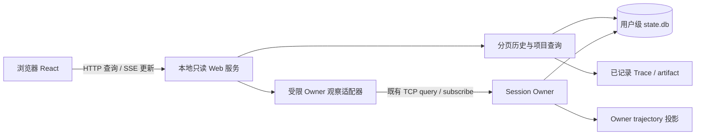

# Plan 15：项目运行数据 Web 展示

> 状态：planned；2026-09-16 完成本地源码调查与实施计划，尚未实现或运行 Web 验收。
> 目标：在浏览器按项目查看 RunLedger 的历史与当前执行，包括对话、工具、轨迹、用量、进程和已有 child 记录。
> 本计划是新增功能编排；Runtime 04/06、Trajectory 和用户级存储专题继续拥有各自合同。

## 1. 结论与范围

采用 **本地只读 Web 看板 + 薄 HTTP 桥 + 既有 Session Owner/存储查询**。参考 oh-my-pi collab-web 的组件和状态同步设计，不迁移其 relay、room key 或 pi-wire 数据模型。

用户流程：在终端执行拟新增的 `runledger web` → 打开本机地址 → 选择项目 → 选择 Session → 查看对话、运行轨迹和统计。原 CLI/TUI 继续执行任务，浏览器实时观察；Owner 退出后仍可阅读已持久化历史。

首版覆盖：项目/会话目录、历史对话和工具卡片、执行状态、Run/Step/Call 轨迹、模型 Token/费用、工具结果详情、已有进程及 child 的只读详情。Plan 状态在当前领域合同稳定后接入，缺失能力显示“不可用”。

首版不提供 prompt、abort、审批、终端输入、恢复 Session、修改配置或多用户共享。浏览器只读由服务端操作白名单保证。远程协作与写操作另立阶段，不通过复制 collab 的 Composer 默认开启。

这里的“项目运行数据”指 RunLedger 执行项目任务时已经保存或发布的数据；不承诺应用自身的 CPU、内存、业务日志或服务健康监控。

## 2. 调查基线与参考映射

调查基线：RunLedger HEAD `82be1dfb7998d3a6a7fe384eea54d43c02a84927`；oh-my-pi HEAD `3b3a6dc9bbd85102ce19d0b1c11bf6870915f6ec`。RunLedger 工作树已有 Plan 模式等并行修改，本计划不以其尚未提交接口作为冻结依赖，也不修改这些文件。

### 2.1 collab-web 可借鉴内容

源码根：`oh-my-pi/packages/collab-web/`，以下均为相对该根的路径。

| 已查源码 | 实际机制 | RunLedger 采用方式 |
|---|---|---|
| `README.md`、`package.json` | React 静态 SPA，Bun 构建，pi-wire 共享合同 | React 展示层独立构建；合同改用 RunLedger browser-safe DTO |
| `src/lib/client.ts` | GuestClient 顺序应用 frame，稳定快照引用，subscribe/getSnapshot；连接状态、流式消息、activeTools | 实现 WebSessionStore；区分持久化事件与临时状态，重连重建快照 |
| `src/components/transcript/Transcript.tsx` | 消息、thinking 折叠、工具关联、跟随尾部滚动 | 移植展示结构与交互，按 RunLedger 消息/工具 ID 适配；增加长列表窗口化 |
| `src/tool-render/ToolView.tsx`、`registry.ts` | 工具 renderer 注册表和通用 fallback | 首批 bash/read/edit/write/search；未知工具安全文本显示 |
| `src/components/agents/AgentDrawer.tsx`、`src/lib/transcript-poll.ts` | child 历史增量读取；临时失败重试、终态错误停止 | 改用 Session/child ID 和有界游标；不读浏览器传入的任意文件路径 |
| `src/components/transcript/Markdown.tsx` | 转义原始 HTML、限制链接协议 | 保留安全语义，覆盖 Markdown/工具输出注入测试 |
| `src/lib/socket.ts`、`codec.ts`、`link.ts` | relay WebSocket、AES-GCM 与分享链接 | 首版本地部署无需搬入；浏览器到 HTTP 桥单独认证 |

参考移植时记录源 commit、文件、许可证和改动说明，保留 MIT attribution；不引入 oh-my-pi workspace 的运行时依赖。工具卡片只适配 RunLedger 实有工具，不复制整套无对应能力的 renderer。

### 2.2 RunLedger 现状与缺口

下列链接均为当前源码入口，属于调查证据，不代表 Web 功能已经存在。

| 数据/机制 | 现有入口 | 缺口与实施要求 |
|---|---|---|
| 项目与 Session 元数据 | [SessionCatalogRecord](../../src/storage/session-store/session-store.ts)、[CatalogRepository](../../src/storage/session-store/catalog-repository.ts) | 已有 workspaceId/repositoryId、标题、状态、时间、headSequence；listSessions 全量查询，需存储层分页与分组 |
| 历史事件与回执 | [SessionQueryHandler](../../src/runtime/session-runtime/query-handler.ts) | snapshot/timeline/receipts/recovery_status 已有；timeline 全量 replay 后 slice，receipts 全量返回，需有界范围查询 |
| 实时连接 | [client-transport](../../src/runtime/session-server/client-transport.ts)、[protocol](../../src/runtime/session-server/protocol.ts) | localhost TCP JSONL 与 authToken 握手，浏览器不能直接使用；需受限桥接适配器 |
| 事件订阅 | [subscription](../../src/runtime/session-server/subscription.ts)、[runtime-server](../../src/runtime/session-server/runtime-server.ts) | 有 cursor/ACK/replay/resync；广播路径 recentEvents 仍读取全部事件，需按序号范围读取；trajectory.changed 无持久化 sequence，idle recap 只发 driver |
| 轨迹与详情 | [trajectory DTO](../../src/runtime/contracts/trajectory.ts)、[TrajectoryService](../../src/runtime/trajectory/service.ts) | 已有分页、搜索、状态、耗时、Token/费用、详情可用性；服务由 Owner 持有，会创建/写入/重建缓存，不能直接让第二进程共同维护同一索引 |
| 用量语义 | [usage](../../src/runtime/usage/index.ts) | 已区分已知/未知及来源；项目聚合需定义去重，不能把 Run/Step/model 每层费用相加 |
| 对话投影 | [Timeline projector](../../src/tui/timeline/event-projector.ts)、[presentation](../../src/tui/presentation.ts) | 有纯投影和稳定行 ID；仍位于 TUI 目录并引用 TuiEvent，需抽出无 OpenTUI/Node 依赖的最小共享部分 |
| 历史读取 | [SessionDatabase](../../src/storage/session-store/database.ts) | 有 readOnly 选项，但 open 的 PRAGMA 路径可能尝试切换 journal mode；需只读打开验证，不启动 Owner、不迁移、不修复 authority |

数据 authority 仍为用户级 `state.db` 和已记录的 Trace/artifact；trajectory SQLite 是可重建投影。不新增项目 `.runledger/`，不复制真实凭据，不把数据库文件直接交给浏览器。

## 3. 页面与数据口径

| 页面 | 首版内容 | 关键行为 |
|---|---|---|
| 项目目录 | 展示名、Session 数、最后活动、可确认的在线数 | 默认 workspaceId 为项目分组；repositoryId 用作仓库关联，不自动合并不同 worktree；无身份记录单列 |
| 项目详情 | 分页 Session 列表、时间范围、状态筛选、累计用量 | 查询范围明确；统计显示 coverage/asOf，不把当前页面总和称为项目总量 |
| Session 对话 | 用户/助手消息、折叠 thinking、工具参数/结果、运行状态 | 默认末尾一页，向上加载；用户上滚后停止自动跟随，可跳回最新 |
| Session 轨迹 | Run → Step → model/tool/context/wait/attempt | 展示状态、耗时、TTFT、Token/费用、来源；无可靠父子关联的 receipt 单列，不猜测绑定 |
| 详情侧栏 | input/output 分页、错误、recording 健康与缺口 | not-recorded/unavailable/corrupt 分别显示；大文本按需读取 |
| 进程/child | 已有进程状态与输出、已有 child 状态及记录 | 遵循现有能力范围；不提供 stdin/kill/revive，不改变 child 默认关闭与单 child 限制 |

状态拆分为：持久化执行状态、Owner 连接状态、数据新鲜度。连接失败只显示“离线/数据可能滞后”，不得把最后一次 running 自动改为成功或失败。

用量聚合以唯一实际模型调用为单位；跨事件/Trace 去重，同一调用的重放或更新替换原 observation。fork 继承历史不重复计入项目新增消耗；重试产生的新调用计入。来源不完整时给出已知部分与缺失数，未知费用不写成 0，估算费用单独标记。无法建立可靠调用身份的历史不计入“完整总额”。

## 4. 数据链路与模块边界

建议目录（待实施创建）：`web/` 放 SPA；`src/web/` 放 HTTP/认证/桥接；`src/contracts/web/` 放 JSON DTO/schema；`src/storage/session-store/` 增加有界读接口。纯展示投影抽至框架无关模块，由 TUI/Web 共用；不要让浏览器 import CLI、SessionStore 或 OpenTUI。与 Plan 13 保持边界一致，不以全仓拆包为前提。

### 4.1 活跃与历史 Session

- 活跃 Session：服务端按既有 owner 身份和握手验证连接，只调用允许的 query/subscribe/ACK；不 claim driver、不抢占、不自动 resume。需要审查现有客户端构造是否附带 claim，必要时新增独立 observer facade。
- 历史 Session：短只读事务读取 catalog/events/receipts；分页重建对话。缺失 DB/schema 不兼容/迁移中返回明确状态，Web 不执行恢复和迁移。
- 活跃轨迹通过 Owner 查询。离线轨迹复用纯 projector，在 Web 自有、可丢弃的临时索引中按需重建；不写 Owner 的 trajectory SQLite，也不直接构造 Owner TrajectoryService。设置每次扫描和总缓存配额、淘汰及关闭清理。Owner 恢复在线后切换数据源并使旧游标失效。
- 项目目录短周期检查 catalog revision；运行状态另外检查 head/已验证 Owner 状态，不能假定每次执行事件都会改变 catalog revision。只为可见 Session 维持实时观察；首页不连接所有 Owner。

### 4.2 拟定 HTTP 合同

所有 `/api/v1` 路由均为新增设计；完整 schema、错误与版本规则在 W01 冻结。

| 路由 | 语义 |
|---|---|
| `GET /api/v1/projects` | workspace 分组分页列表 |
| `GET /api/v1/projects/:id/sessions` | Session 分页、筛选 |
| `GET /api/v1/projects/:id/usage` | 带时间范围、来源、coverage 的去重聚合 |
| `GET /api/v1/sessions/:id/snapshot` | 有界首屏、连接状态、持久化 watermark |
| `GET /api/v1/sessions/:id/timeline` | before/after 游标分页；限制条数与字节 |
| `GET /api/v1/sessions/:id/trajectory` | 复用轨迹 page/search 语义 |
| `GET /api/v1/sessions/:id/trajectory/:recordId/detail` | input/output 按需分页 |
| `GET /api/v1/sessions/:id/events` | SSE 持久化变更、失效通知、连接状态 |
| `GET /api/v1/sessions/:id/processes`、`.../children` | 显式只读适配，未装配时 unavailable |

公开 DTO 仅包含已审查字段、opaque ID/digest/locator；内部 sourceWorkspaceLocator、端口、Owner token、配置和原始整行 JSON 不透传。Artifact 访问必须验证归属 Session，不能凭 digest 读取其他 Session 的内容。

### 4.3 快照、增量与断线恢复

1. 在一致读视图中读取 snapshot 与其覆盖的 sequence=S；随后订阅 S 之后的事件。已发生的变化通过有界 replay 补齐，不能采用“先快照再只听新消息”。
2. 浏览器以 sessionId + sequence 去重；传输游标还绑定 Owner generation 和数据源 epoch。Owner 更换、历史源切换或游标超窗返回 resync_required，取消旧请求并重新获取快照。
3. trajectory.changed 等无序号通知仅触发节流查询，不推进持久化 cursor；不同日志序号不能混用。逐 Token 展示要先验证 observer 实际收到的协议，未提供时显示已提交消息和执行中状态，不伪造实时全文。
4. Web 到 Owner 的 ACK 与浏览器恢复游标分开。桥只在有界队列接纳后 ACK；浏览器慢时主动断开并要求补读，不能无限累积或声称浏览器已经消费。
5. SSE 心跳、指数退避和 AbortController 清理；断线保留已显示内容并标记陈旧。目录首版可用 2 秒 revision 轮询，后台页退避。

## 5. 部署、安全与性能

- `runledger web` 显式启动前台服务，默认只绑定 `127.0.0.1`；退出服务不停止 Owner。复用一次解析的 RunledgerLayout。首版不提供自动守护、公网绑定或远程 relay。
- 独立高熵 Web 启动凭据，通过一次性 fragment 引导兑换 HttpOnly/SameSite cookie，并立即清除 fragment；无 query-string 凭据、无日志泄漏。验证 Host/Origin，默认同源、不开放任意 CORS；SSE 同样认证。关闭服务使该实例登录失效。具体本地 HTTP cookie 属性在 W03 验证。
- 路由仅映射明确的读操作，拒绝通用 command/domain proxy；不把 Owner 认证凭据发到浏览器。Markdown、链接、图片、工具输出按不可信内容渲染，禁用任意 HTML、外部资源默认不自动加载。
- 沿用 trajectory 页默认 50/最大 200、页 192 KiB、详情 48 KiB 的现有上限；其他列表也同时设行数和字节上限，SQL 范围分页，不全量加载后切片。
- 首版验收数据规模：1,000 Session、单 Session 100,000 事件、10 个浏览器观察者；在记录硬件/浏览器版本的本机基线上，温缓存首屏 p95 ≤ 1 秒、持久化事件到可见 p95 ≤ 500 ms。冷重建须可取消、有进度且不阻塞请求；记录耗时与内存，不用温缓存数字替代。
- 连续观察 30 分钟内存应趋于稳定；慢浏览器退出不拖慢 Owner；增加观察者不得导致逐观察者全量 replay。对 TUI 执行吞吐做有/无 Web 对照。

## 6. 实施任务与验收门禁

所有任务当前均为 pending，完成后原地补充提交与证据。

| ID | 交付 | 依赖 | 验收 |
|---|---|---|---|
| W01 | 冻结页面范围、browser DTO、项目身份、状态/用量语义、移植文件清单 | 无 | 合同 consumer 不依赖 Node/OpenTUI；每个字段有来源及缺失行为 |
| W02 | 只读历史 facade、SQL 分页、目录分组、离线临时轨迹投影 | W01 | 真实隔离 SQLite：旧/新页稳定、损坏/迁移明确失败；读后 authority 内容/owner generation 不变；缓存无并发争写 |
| W03 | `runledger web`、静态资源打包、HTTP 认证、只读 API | W02 | 构建后的真实 CLI 启动/退出；鉴权失败、跨站请求、非法参数和越权 artifact 均拒绝 |
| W04 | Owner observer、快照/replay、SSE、范围广播与背压 | W01/W03 | 实际 Owner TCP：快照期间追加、重复、断线、generation 更换、慢消费者；不 claim driver、不漏已提交事件 |
| W05 | 项目目录、Session 对话、工具卡片、轨迹和详情 | W03/W04 | 浏览器真实 HTTP：切换会话无串流、历史分页锚点稳定、未知工具 fallback、错误/缺失状态可见 |
| W06 | 去重用量、进程/child 只读页、可用的 Plan 摘要 | W02/W05 | fork/retry/缺失 usage 对账；已有能力正确展示，未装配明确 unavailable；无写操作 |
| W07 | 安全、长会话性能、安装包和文档验收 | W06 | 上述规模与并发测试；恶意 Markdown；打包后静态路径可用；启动帮助、截图、录屏/请求证据 |

实施顺序：先做一条“真实隔离 Session → HTTP → 浏览器历史页”闭环，再接实时和更多数据。W01–W05 构成基础可用切片；W06–W07 完成后才称首版范围交付。

代码实施按仓库要求执行 `npm run check`、受影响测试，进入 dist 后执行 `npm run build` 和真实 CLI 验证；提交代码前完成适用的全套测试。新增 Web 测试须登记现有 test inventory/runner，不能只单独运行而漏出门禁。

浏览器验收使用隔离 RUNLEDGER_DIR 的真实服务。fixture 用于异常与规模场景；至少另跑一次真实 Owner 执行并将页面与 ledger 对账。外部 provider 的真实模型调用另列证据，不能用 mock-host 截图替代；本计划阶段不使用真实用户数据做测试。

## 7. 与既有计划的关系及当前交付

- [Runtime 06](../runtime/06-session-owner-runtime-replacement-plan.md)：保持 Session Owner authority，Web 服务是显式启动的查询适配器，不恢复旧 Host/machine daemon。
- [Trajectory](../trajectory/01-runtime-trajectory-implementation-plan.md)：沿用数据合同与 recording 行为，离线投影拆分需保持 Owner 原路径回归。
- [Plan 13](13-package-boundary-workspace-refactor-plan.md)：共享纯合同边界兼容，独立 UI 构建不要求全仓迁移。
- [历史远程控制路线](../tui/09-remote-control-roadmap.md)：属于远期历史设计；本计划只读 Web 的新增范围不意味着其远程写入能力已启用。

本次仅新增计划及两处导航；验证为源码路径/文档链接检查、内容与边界审阅、`git diff --check`。未修改运行时代码，未执行构建、Web 启动、浏览器或真实模型验证。
