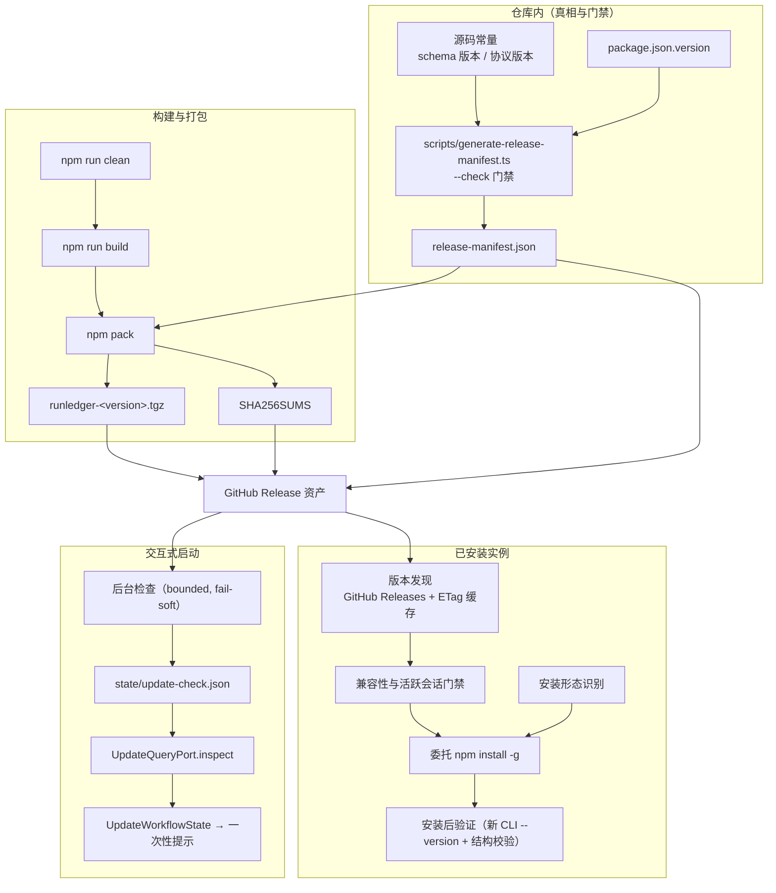

# RunLedger 版本升级与发布设施实施计划

> 文档状态：`planned`（尚未实现；R0–R7 全部 pending）
> 建立日期：2026-09-17
> 现状事实与实测证据：[00-release-baseline.md](00-release-baseline.md)（本文只引用其结论，不重复实测数字）
> 参考输入：
> - `feat/agent-loop-resurrect` 线的 managed auto-update 设计与 runbook（见 §7）
> - oh-my-pi 的 `omp update` 载体识别与委托实现（`packages/coding-agent/src/cli/update-cli.ts`，工作树 `oh-my-pi`）
> 状态规则：本文是该专项的唯一状态账本；阶段只有在当前工作树具备 RED 证据、实现、
> 对应门禁与真实安装/升级证据后才可标 `implemented`。

## 0. 目标、裁定与非目标

### 0.1 目标

让 RunLedger 具备可复现、可校验、可发现、可回退的**分发与升级链路**：

1. 一条命令产出**确定性的发布产物**（tarball + 兼容性清单 + 校验和），且产物自身能通过一致性检查；
2. 版本号只有一个真相，任何漂移在 CI 被拒绝；
3. 已安装的 RunLedger 能**发现**新版本、**判断兼容性**、**委托包管理器安装**、**验证结果**，
   并且在不兼容/有活跃会话/开发链接等情形下 fail closed 而不是半途改造安装；
4. 交互式启动给出**非阻塞的一次性升级提示**，复用已冻结的被动合同，不新增 TUI authority。

### 0.2 已裁定的范围（本次与用户确认）

| 议题 | 裁定 |
|---|---|
| 是否公开发布到 npm | **否**。第一期不 publish 到公共 registry |
| 分发通道 | **npm 包（tarball）+ 源安装脚本**；不做 standalone 二进制 |
| 升级面边界 | **启动提示 + `runledger update` 委托**；不自研原地自更新、不做签名频道与激活编排 |

据此，第一期的"registry"是 **GitHub Release 资产**，安装动作委托 `npm install -g <tarball URL>`；
公共/私有 registry 作为后续开关保留（R3.9、R5.6），不在本期启用。

### 0.3 非目标（本期明确不做）

- 签名 channel manifest、Ed25519 keyring、rollout/revocation、最低/最高版本策略服务端熔断；
- managed installation（版本化目录 + 稳定 shim）、原子激活/回滚、后台自动激活；
- 常驻 Host 的 `auto_update` 停机与 `maintenance_restart` 编排（legacy 线，见 §7）；
- standalone 二进制、brew/winget/mise/nix 集成；
- macOS/Windows 的发布流水线与升级验收（本期只交付 Linux 证据，跨平台单列 pending）；
- 任何形式的**隐式数据迁移**：`update` 不得触发 schema 迁移（`AGENTS.md` 的显式迁移入口约束）。

## 1. 目标架构



### 1.1 关键设计决定

| 决定 | 理由 | 被否方案 |
|---|---|---|
| **D1** 版本真相 = 根 `package.json.version`，其余全部派生 | 现状 4 处手写（00 §2）是漂移源头 | 每处各写各的 + 测试兜底（现状，已被证明会漏） |
| **D2** `release-manifest.json` 只含**源码可派生的确定性字段**（版本、兼容性包络、engines），提交进仓库并由 `--check` 门禁守住 | 提交物可 diff 审阅；`update` 无需安装即可判断目标版本兼容性 | 含构建期自哈希的清单（自引用循环，且无法提交/审阅） |
| **D3** 产物完整性靠 **Release 资产 `SHA256SUMS`**（覆盖 tarball），在下载后、安装前校验；**不发明第二套安装树哈希链** | npm 全局安装**不留下** `integrity` 记录（实测：`lib/node_modules/.package-lock.json` 不存在），没有可复用的信任根；发明一套改动面大且收益有限 | 安装树自哈希 + 独立校验命令（留作后续，且需先解决信任根分发问题） |
| **D4** 打包边界由**单一产物谓词**驱动，`files`、legacy manifest 生成、`check-package-contents` 共用 | G1 的根因就是两套规则各自维护（00 §5.3） | 各写各的 `files` 与 `isExecutableArtifact`（现状） |
| **D5** 新发布/升级代码落在 `src/release/`，**禁止** import `host-build-identity`、`storage/host/*`、`runtime/host/*` | `scripts/check-session-owner-boundaries.ts:47-55,69-89` 把这些列为 legacy Host 来源且"新文件不得加入" | 复用 `host-build-identity` 作为新链路的信任根（会被边界检查拒绝） |
| **D6** `update` 的默认行为是**拒绝在活跃会话期间安装**（`--force` 才继续），永不自动迁移数据 | 标准入口是 session-scoped 内嵌 Owner（`src/cli/main.ts:51`），文件替换与运行中进程、`state.db` writer 语义相互独立但风险叠加 | 覆盖安装后继续（现状语义），或自研 drain 编排（本期非目标） |
| **D7** 升级提示复用已冻结的被动合同（`src/tui/update/types.ts`），`inspect` 保持只读 | `tests/tui/governed-mutations.test.ts:247-252` 已把"no download or activation"钉死为合同 | 在 inspect 内直接下载/激活（违反已冻结合同） |
| **D8** 第一期"来源"是 GitHub Release 资产，不是 registry | `runledger` 包名在公共 registry 已被占用（00 §2）；资产分发无需 publish 即可端到端可用 | 直接 `npm publish` 同名包（不可能）；改用未被占用的名字并发布（非本期裁定） |

## 2. 冻结合同

### 2.1 `release-manifest.json`

位置：仓库根（`files` 白名单收录，随 tarball 分发为 `package/release-manifest.json`）。

```json
{
  "format": "runledger-release-current",
  "packageName": "runledger",
  "packageVersion": "0.0.1",
  "engines": { "node": ">=22.19.0", "bun": ">=1.3.0" },
  "requiresLifecycleScripts": ["node-pty"],
  "compatibility": {
    "sessionStoreSchema": { "min": 1, "max": 7, "current": 7 },
    "sessionOwnerProtocol": 1,
    "hostProtocol": 1,
    "hostSessionStorageContract": 1,
    "extensionHostProtocol": 1,
    "nativeSyntaxApi": 1,
    "tuiPreferences": { "min": 1, "max": 2 }
  }
}
```

不变量：

- 所有字段**从源码常量导入生成**（生成脚本 import 真实模块，不做正则抽取）；无法导入的字面量
  必须先提升为显式 `export const`（R2.2 交付物）。
- `format` 采用仓库既有的"`runledger-<域>-current`"命名习惯（同 `runledger-host-build-current`、
  `runledger-host-shutdown-intent-current`），不引入数字代际标记（受 `scripts/check-current-format.ts:43-50` 约束）。
- 不含任何自引用哈希；不含时间戳（保持提交确定性）。
- `update` 读**目标版本**的该文件判断兼容性；`doctor` 读**本地**的该文件并与源码常量比对（`check:release-manifest` 已保证两者一致）。

### 2.2 分发产物谓词

新模块 `src/release/distribution-files.ts` 导出：

```ts
export const DISTRIBUTION_EXCLUDED: readonly string[];          // 见下
export function isDistributionArtifact(relativePath: string): boolean;
```

必须排除（当前工作树实测存在）：

| 模式 | 理由 |
|---|---|
| `**/*.map` | 3489 个文件 / 13.21 MB，占 unpacked 34.9%（00 §4）；dev 树保留 |
| `dist/native/runledger-syntax-highlighter.node` | 由 optional leaf 包提供；根包排除是既有策略（`package.json:68`、`tests/tui/syntax-highlighter-packaging.test.ts:32`） |
| `dist/update/**`、`dist/daemon/**`、`dist/verification-runner/**` | 无对应源码，属陈旧构建残留（00 §3） |
| `dist/native/runledger-peer-broker` | 无任何脚本再生成（00 §3） |

消费方（三者必须一致，由 R1.3 的门禁保证）：

1. `package.json` 的 `files` 白名单（人工维护，门禁校验等价性）；
2. legacy `src/cli/host-build-identity.ts:142-145` 的 artifact 选择（**只改谓词，不做其它改动**，
   见 R2.3）；
3. `scripts/check-package-contents.ts` 的期望集合。

### 2.3 安装形态

新模块 `src/release/installation-shape.ts`：

```ts
export type InstallationShape =
  | { readonly kind: "npm-managed"; readonly prefix: string; readonly packageRoot: string }
  | { readonly kind: "link"; readonly packageRoot: string }
  | { readonly kind: "source"; readonly packageRoot: string }
  | { readonly kind: "unknown"; readonly packageRoot: string };
export function detectInstallationShape(): Promise<InstallationShape>;
```

判定顺序（全部本地、无网络）：

1. 载入模块路径以 `.ts` 结尾（当前进程由 tsx/bun 直接跑源码）→ `source`；
2. 从包根向上找含 `package.json` 且 `name === "runledger"` 的目录作为 `packageRoot`；
3. `lstat(join(prefix, "lib", "node_modules", "runledger")).isSymbolicLink()` 且指向 `packageRoot`
   → `link`（本机实测形态：`~/.npm-global/lib/node_modules/runledger -> <repo>`，00 §6.6）；
4. `packageRoot` 位于 `join(prefix, "lib", "node_modules")` 之下 → `npm-managed`（`prefix` 来自
   `npm prefix -g`，或安装时显式 `--prefix`；两者行为相同）；
5. 其余 → `unknown`。

行为映射：

| shape | `runledger update` 行为 |
|---|---|
| `npm-managed` | 允许委托 `npm install -g --prefix <prefix> <tarball URL>` |
| `link` | 拒绝（`update_unsupported_installation`），打印 `git pull && npm ci && npm run build` |
| `source` | 拒绝，同上 |
| `unknown` | 拒绝，打印下载与手动安装命令 |

### 2.4 升级策略设置

新增用户级 settings 字段（与 `recording` 同级的"用户/设备级 authority"）：

```ts
interface ProjectSettings {
  /** 用户级升级提示策略；workspace 层不拥有该 authority。 */
  update?: { mode?: "off" | "notify"; source?: string };
}
```

- 默认 `{ mode: "notify" }`。
- `source` 缺省 `Crsei/RunLedger`；允许配置为另一个 GitHub `owner/repo`，为将来的私有分发留出开关。
- workspace 层出现 `update` 时按既有做法拒绝（`src/storage/settings-manager.ts:447-467` 的
  `assertSupportedSettings` 增加分支，措辞照 `recording`）。
- 未识别字段继续走既有"丢弃未知键"语义。
- 检查只在**交互式 TTY**且 `mode !== "off"` 时进行（见 R4）。

### 2.5 `runledger update` CLI 合同

```
runledger update [--check] [--to <version>] [--force] [--json] [--source <owner/repo>]
```

| 参数 | 语义 |
|---|---|
| 无参数 | 发现最新适用版本 → 门禁 → 委托安装 → 验证；已是最新则输出 `already_latest` 并成功退出 |
| `--check` | **只读**：输出当前/可用版本、兼容性判定、需要的迁移动作；不触碰任何文件、不执行网络写操作、不安装 |
| `--to <version>` | 指定目标版本（降级只允许在兼容判定通过时，见 §5） |
| `--force` | 覆盖活跃会话门禁（D6）；不越过兼容性、完整性或 shape 门禁 |
| `--json` | 机器可读输出；字段稳定，供 CI/脚本消费 |
| `--source <owner/repo>` | 本次覆盖 settings 的 `source` |

退出码：

| 码 | 含义 |
|---|---|
| 0 | 成功（含 `already_latest`、`--check` 正常输出） |
| 2 | 参数错误或门禁拒绝（活跃会话、`migration_blocked`、shape 不受支持） |
| 3 | 目标版本不可发现（无 release、tag 与 manifest 版本不一致） |
| 4 | 兼容性拒绝（可能造成不可逆降级） |
| 5 | 下载或校验失败（sha256 不符、资产缺失） |
| 6 | 委托安装失败或安装后验证失败 |

门禁顺序（任一失败即停，不进入下一步）：

```
shape 支持 → 目标发现 → 目标 manifest 校验 → 完整性校验 → 兼容性判定
          → 活跃会话/迁移门禁 → 委托安装 → 安装后验证
```

`update` 永不：迁移数据、修改 `~/.runledger` 的既有数据文件、写 settings、绕过代理环境变量、
在 `--check` 下创建文件。

## 3. 阶段

### R0 版本单一真相与法律/技术必要文件

**目标**：消除版本漂移，补齐分发必需文件。

交付物：

- R0.1 `src/release/package-identity.ts`：`readPackageIdentity()`（name/version/engines），
  取代 `src/cli/main.ts:772` 的私有实现；`--version` 输出格式不变（`runledger <version>`，`src/cli/main.ts:142-145`）。
- R0.2 `scripts/sync-release-versions.ts [--check]`：把根 `version` 同步到
  `package.json:148-157` 的 8 个 pin 与 `npm/syntax-highlighter-*/package.json`；
  `--check` 漂移即非零退出。新增 `npm run check:release-versions`。
- R0.3 仓库根新增 `LICENSE`（MIT，与被占用的 registry 条目无关，仅本仓库法律文本）；
  `files` 收录 `LICENSE` 与 `CHANGELOG.md`（npm 对 `LICENSE*` 有自动收录，但显式列出更稳）。
- R0.4 `CHANGELOG.md` 版本段提升脚本（`scripts/promote-changelog.ts`）：把 `[Unreleased]`
  提升为 `[<version>] - <date>` 并补新的 `[Unreleased]`；无内容时不产生空段。

验收：

- `npm run check:release-versions` 在人为改坏任一 pin 后失败，恢复后通过；
- `npm pack --dry-run --json` 的清单含 `LICENSE`、`CHANGELOG.md`；
- `tests/tui/syntax-highlighter-packaging.test.ts:30-42` 仍然通过（该测试钉死 leaf 版本 = 根版本，与 R0.2 一致）；
- `runledger --version` 输出不变。

证据：两条 `--check` 命令的输出、pack 清单片段。

风险：把 `--version` 读取抽到新模块会触及 `src/cli/main.ts` 的 import 列表，
需确认不引入 `tests/cli/session-owner-cli.test.ts:189-197` 禁止的模块名。

### R1 清洁构建与打包边界门禁

**目标**：tarball 只包含有源码对应的分发产物；体积可控且可回归。

交付物：

- R1.1 `npm run clean`：删除 `dist/`、`packages/collab-web/dist/`、`.tsbuildinfo` 等生成目录；
  接入 `build` 前置（`package.json:79` 改为 `clean && …`）。构建后 `dist/` 不得再出现
  `update/`、`daemon/`、`verification-runner/`、`native/runledger-peer-broker`。
- R1.2 `files` 收紧：排除 `**/*.map`，并按 §2.2 显式排除无源码目录（作为 R1.1 之后的第二道防线）。
- R1.3 `scripts/check-package-contents.ts` + `npm run check:package-contents`：执行
  `npm pack --dry-run --json`，断言：
  1. 每个条目都满足 `isDistributionArtifact`（§2.2）；
  2. 必需文件存在：`package.json`、`bin/runledger.js`、`dist/cli/cli.js`、
     `dist/tui/components/tips.txt`、`assets/tree-sitter/*.wasm`、`README.md`、`LICENSE`、
     `CHANGELOG.md`、`release-manifest.json`；
  3. 禁止项不存在：`dist/native/runledger-syntax-highlighter.node`、`dist/update/**`、
     `dist/daemon/**`、`dist/verification-runner/**`、`dist/native/runledger-peer-broker`、
     任何 `*.map`；
  4. 条目数与 unpacked 字节数不超过预算（基线 8463 / 37.85 MB；本阶段目标为排除 `.map`
     与残留后**显著下降**，阈值在 R1.3 落地时按实测冻结，之后只允许下调或在计划里显式记录放宽理由）。
- R1.4 `package.json:125` 的 `dependencies["@runledger/collab-web"] = "*"` 改为与根版本一致的
  精确版本（bundle 已随包分发；精确版本避免 registry 解析歧义）。

验收：

- `npm run clean && npm run build` 后 `dist/` 无残留目录；`npm run check:package-contents` 通过；
- 人为删除 `LICENSE` 或恢复一个残留目录后门禁失败（RED 证据）；
- 隔离 prefix 安装新 tarball 后 `runledger --version` 与不带 `--omit=optional` 的安装都成功。

风险：`clean` 会删除开发者手工放进 `dist/` 的内容（预期行为，需在 plan 与 README 说明）；
排除 `.map` 会让已安装包的栈追踪失去源码映射（dev 树不受影响，需在 CHANGELOG 说明）。

### R2 分发身份与安装形态识别

**目标**：让"发布产物"有可读的兼容性清单；让"已安装实例"能被准确分类；修掉产物集合自校验失败。

交付物：

- R2.1 `src/release/release-manifest.ts`：读/校验 `release-manifest.json` 的类型与 guard，
  typed error code（`release_manifest_missing | release_manifest_invalid | release_manifest_mismatch`）。
  **不得** import `host-build-identity` 或任何 legacy Host 模块（D5）。
- R2.2 `scripts/generate-release-manifest.ts [--check]`：import 真实源码常量生成 §2.1 的清单；
  无法导入的字面量先提升为 `export const`（例如 `src/tui/highlight/native-loader.ts` 的 addon
  `apiVersion`、`src/contracts/extensions/host-protocol.ts:30`）。新增
  `npm run check:release-manifest`。
- R2.3 修 G1：把 `src/cli/host-build-identity.ts:142-145` 的 artifact 谓词改为消费
  `isDistributionArtifact`，使 legacy manifest 描述**可分发集合**；
  并新增打包回归测试：`npm pack` → 解 tarball 到临时目录 → 在该目录调用
  `loadVerifiedHostBuildManifest` 必须成功。
  同时修改 `tests/cli/host-build-identity.test.ts:63-77` 的断言口径：改为断言
  "非分发产物（本地 addon）不进入 identity"，理由是该断言与分发合同直接冲突，
  并保留"分发产物字节变化会改变 contentDigest"的正向覆盖。
- R2.4 `src/release/installation-shape.ts`（§2.3）+ 单元测试（临时目录 fixture
  覆盖四种 shape）。
- R2.5 `package.json` 增加 `release-manifest.json` 到 `files`。

验收：

- **RED → GREEN**：先写"打包后校验"测试证明当前失败（`host_build_manifest_artifact_set_mismatch`，
  00 §5.3 的手工复现），改谓词后通过；
- `npm run check:release-manifest` 在常量与清单不一致时失败；
- 隔离 prefix 安装的树通过 `release-manifest` 校验；`doctor`（R6）能报出 shape。

风险：legacy manifest 与 tarball 的一致性只在 Linux 构建机上成立（helper 只在 Linux 生成，
`scripts/build-linux-peer-credential-helper.ts` 非 Linux 直接 return）。发布必须从 Linux runner
产出根 tarball，此约束写进 R5。

### R3 升级命令与委托

**目标**：`runledger update` 可用、可审计、可拒绝、可回退。

交付物：

- R3.1 `src/cli/update-command.ts`（新文件）。`src/cli/main.ts` 仅新增一次分派
  （在 `:113-131` 的既有子命令分支旁），不得引入被禁模块名。
- R3.2 `src/release/release-source.ts`：版本发现。第一期实现 `github-release` 源：
  `GET /repos/<source>/releases/latest`（或 `/releases/tags/v<version>`），读取 Release 资产中的
  `release-manifest.json` 并校验 tag ↔ `packageVersion` 一致，读取资产 `runledger-<version>.tgz`
  与其 sha256（从 `SHA256SUMS` 资产解析）。凭据顺序 `GITHUB_TOKEN` → `GH_TOKEN` →
  `gh auth token`；限流或不可达 → typed error，不静默降级到"无更新"。
- R3.3 `src/release/update-plan.ts`：纯函数编排 §2.5 的门禁顺序，产出
  `{ action: "install" | "already-latest" | "refuse"; reasons: [...] }`，便于单测。
- R3.4 活跃会话门禁：读 `state.db` 的 owner 状态（复用 `countActiveOwners`，
  `src/storage/session-store/schema-compatibility.ts:124-130`），>0 时返回
  `update_requires_sessions_closed`（措辞对齐既有 `active_owners_present` /
  `upgrade_requires_sessions_closed`），exit 2；`--force` 时打印风险说明后继续。
- R3.5 迁移门禁：`admission !== "ready"` → 拒绝；安装后若
  `storeVersion < SESSION_STORE_SCHEMA_VERSION` → 打印既有指令原文
  `runledger migrate schema --confirm`，exit 0（安装成功但需用户后续动作，输出中显式为
  `migration_required: true`）。**不自动执行迁移**。
- R3.6 委托与验证：`npm install -g --prefix <prefix> <tarball URL>`；随后
  `<prefix>/bin/runledger --version` 必须等于目标版本，且新安装树的
  `release-manifest.json.packageVersion` 一致；失败 → exit 6 并打印
  `npm install -g runledger@<旧版本>` 形式的回退指令（回退同样由用户/包管理器执行，
  本期不做自动回滚）。
- R3.7 降级兼容判定（§5.3）：目标 `sessionStoreSchema.max < 本地 storeVersion` → exit 4，
  不提供 `--force` 例外（无 down-migration 事实，00 §6.1）。
- R3.8 `--json` 输出 schema 与退出码表写入 `docs/cli.md`（`update` 新章节）。
- R3.9 预留 `update.registry`（settings 字段留空实现，仅登记为非目标与接口形状），
  使公共/私有 registry 阶段无需改 CLI 合同。

验收（Linux，隔离环境）：

- 真实验收脚本 `scripts/verify-release-upgrade.ts` 覆盖：
  1. 无更新 → `already_latest`，退出 0；
  2. 有新版本 → 委托安装 → `--version` 等于目标；
  3. 活跃会话存在 → 拒绝（exit 2），`--force` 后继续；
  4. 目标 manifest 声明 `sessionStoreSchema.max` 低于本地 store 版本 → exit 4；
  5. sha256 被篡改 → exit 5，且**未执行任何安装**；
  6. `link`/`source` shape → 拒绝（exit 2），不修改任何文件；
  7. `--check` 前后对安装目录与 `RUNLEDGER_DIR` 做快照比对，必须逐字节一致。
  证据以 JSON 落盘（命名沿用 `runledger.*` 前缀）。
- 单测覆盖 R3.3 的判定表与每个退出码分支。

风险：委托 `npm install -g` 在 POSIX 上会替换运行中进程已加载的文件（本期以"默认拒绝活跃会话"
覆盖）；Windows 文件锁问题属跨平台验收，本期单列 pending。

### R4 启动升级提示（被动合同接线）

**目标**：交互式启动给出一次性、非阻塞、可关闭的升级提示；不改变 TUI authority。

交付物：

- R4.1 `src/release/update-check.ts`：`checkForUpdate()`——bounded（5s 超时）、fail-soft
  （任何错误归为"无可用信息"）、无凭据要求地读 Release；结果缓存到
  `~/.runledger/state/update-check.json`（0600，字段：`checkedAt`、`source`、`latestVersion`、
  `etag`、`notifiedVersion`）；TTL（建议 24h）与 `etag` 双条件减少请求；同一 `latestVersion`
  只提示一次。
- R4.2 `src/cli/update-query-port.ts`：实现 `UpdateQueryPort.inspect`（`src/tui/update/types.ts:22-25`），
  **只读缓存**，返回 `UpdateNoticeView`；`policy` 映射：可升级且允许提示 → `informational`；
  `mode === "off"` → `disabled`；无缓存/未知 → `unknown`。严格满足
  `tests/tui/governed-mutations.test.ts:247-252`。
- R4.3 启动触发：标准 CLI 在 interactive 模式（`src/cli/main.ts` 进入 `InteractiveMode` 之前）
  启动一次**不 await 的背景检查**；检查失败只写 debug 日志，不写 stderr 噪声；
  非 interactive（headless/rpc/web/`--version`）一律不检查。
- R4.4 提示消费：把 `ports.update` 注入 TUI 应用层并派发一次 `update.inspect`
  （`src/tui/application/effect.ts:38` → `effect-runner.ts:188-189` → reducer `updateWorkflow`），
  `ready` 状态渲染为一次性提示。渲染归属与 Plan 19（被动合同集成）的 B 阶段一致；
  若 Plan 19 尚未接线，本阶段只交付 port + 派发 + 状态可用，并把"视觉呈现"单列为 pending，
  不得以状态层就绪冒充用户可见。
- R4.5 关闭开关：settings `update.mode = "off"` 使检查与提示都不发生；
  workspace 层设置被拒绝（§2.4）。

验收：

- 单测：`inspect` 在读不到缓存时返回 `unknown` 且不发起网络；`mode: "off"` 返回 `disabled`；
  相同 `latestVersion` 只提示一次（用注入时钟与假 fetcher）。
- 端到端：隔离 `RUNLEDGER_DIR` + 假 Release 响应下，交互式启动不阻塞（启动耗时增量有界）、
  网络不可达时 stderr 无非预期输出（fail-soft 证据）；
- `--check` 与 `--version` 路径不触发任何网络（用假 fetcher 断言零调用）。

风险：启动检查发生在任何 Session 之前，不经过 Session Security/ExecutionGateway（它不是工具
副作用）。因此它必须无凭据、只读、可关闭，并且在计划与 `docs/cli.md` 里写明这一点，
避免被理解成"存在一个绕过网络策略的出口"。

### R5 发布流水线与门禁

**目标**：tag 产出的东西可复现、可校验、可安装；main/PR 永不发布。

交付物：

- R5.1 `.github/workflows/release.yml`：`push: tags: ["v*"]` 与 `workflow_dispatch`。
  jobs：
  1. `verify-gate`——复用 `test.yml` 的全部必需 job（或 `needs` 等价聚合），外加
     `check:release-versions` / `check:release-manifest` / `check:package-contents`；
  2. `pack`（`ubuntu-24.04`，Linux-only 依据 R2 风险项）——`npm ci` → `npm run clean` →
     `npm run build` → `npm pack` → `SHA256SUMS` → 隔离 prefix 安装 smoke
     （`runledger --version`、`runledger --help`、`loadVerifiedHostBuildManifest`、
     `node-pty` 可用性）；
  3. `publish-release`——创建 GitHub Release（`v<version>`），资产含 tarball、
     `release-manifest.json`、`SHA256SUMS`；notes 由 R5.5 生成；
  4. `publish-npm`（默认关闭，`workflow_dispatch` 输入 `publish=true` 才执行）——
     仅发布根包与 leaves，registry/名称在此之前必须重新裁定（G5）。
- R5.2 native leaves：复用 `.github/workflows/syntax-highlighter-prebuild.yml`，
  补两个门禁：leaf 版本 = 根版本（已有测试钉死，需要 CI 也拒绝）、
  leaves 全部未发布时根 tarball 的安装 smoke 仍必须成功（可选依赖缺失的降级路径）。
- R5.3 `scripts/install.sh`：`--tarball <url>`（下载 + sha256 校验 + `npm install -g`）与
  `--source [--ref <ref>]`（clone + `npm ci` + `npm run build`）；不实现自更新，
  不写用户 `PATH` 以外的位置，失败时不留半成品。
- R5.4 发布前置事实检查：tag ↔ `package.json.version` ↔ `release-manifest.json.packageVersion`
  三者一致，否则拒绝发布。
- R5.5 `scripts/release-notes.ts`：从 `CHANGELOG.md` 取该版本的段落生成 notes；
  缺失时失败而不是发布空 notes。
- R5.6 `scripts/release.ts`（bump / sync / check / tag）：`bump` 提升版本 + 同步 pin + 提升
  CHANGELOG + 运行门禁；`tag` 只允许在 main 且工作树干净时创建并推送 `v<version>`。

验收：

- 在 fork 或以 `workflow_dispatch` + `publish=false` 的干跑中完成一次完整流水线，
  产出资产可回读且 sha256 自洽；
- 人为制造 tag/版本不一致 → `pack` 之前失败（RED 证据）；
- 隔离 prefix 从 Release 资产 URL 安装成功（`npm install -g <url>`）。

风险：无签名机制意味着"发布资产可信"只由 GitHub 平台与仓库权限保证（本期接受，
签名频道属 §0.3 非目标）；需要 `update`/`install.sh` 明确 sha256 校验，不能省。

### R6 安装一致性诊断

**目标**：一条只读命令回答"我这套安装是什么、能不能升级、缺什么"。

交付物：

- `runledger doctor [--json]`（或接入既有诊断入口，命名在实现时按 CLI 习惯统一）：
  输出 shape、packageRoot、prefix、当前版本、`release-manifest.json` 校验结果、
  `state.db` store 版本与兼容判定、活跃 owner 数、待执行的迁移指令、
  `node-pty` 可用性、syntax addon 状态（`native_unavailable` 属预期而非故障）、
  以及可复制的修复命令。
- 与 R3 共用 `installation-shape` / `release-manifest` / `update-plan`，**不得**重复实现判定。

验收：在隔离 prefix 的三种安装形态（链接、tarball 安装、源码）下输出正确分类；
在人为破坏 `release-manifest.json` 与删除 `node-pty` 构建产物时给出可读诊断。

### R7 验收证据与跨平台边界

**目标**：把"通过了什么"与"还没通过什么"分开记录。

- Linux 自动化矩阵 = R3.6 的端到端脚本 + `check:*` 门禁 + 隔离 prefix 安装；
- 人工验收 = 真实全局 `npm install -g`、真实 `~/.runledger` 下的升级一次、
  交互式提示的视觉确认；
- 跨平台 = macOS/Windows 的安装、`node-pty` 获取、文件锁下的替换行为，全部 pending；
- 证据文件命名沿用仓库习惯（`runledger.release-*` 前缀），并在本文 §8 状态表登记路径与日期。

## 4. 门禁矩阵

| 门禁 | 命令 | 覆盖的失效 | 引入阶段 |
|---|---|---|---|
| 版本一致性 | `npm run check:release-versions` | 版本真相漂移（G3） | R0 |
| 发布清单一致性 | `npm run check:release-manifest` | 清单与源码常量不一致 | R2 |
| 打包边界 | `npm run check:package-contents` | 残留产物、白名单漏洞、体积回归（G2/G10） | R1 |
| 打包后自校验 | 打包 → 解包 → `loadVerifiedHostBuildManifest` | G1（产物集合不一致） | R2 |
| 安装 smoke | 隔离 prefix `npm install -g <tgz>` + `--version`/`--help` | 起不来的 CLI、缺文件（G7） | R5 |
| 升级端到端 | `scripts/verify-release-upgrade.ts` | 门禁顺序、退出码、`--check` 只读性 | R3/R7 |
| 既有门禁 | `npm run check`、`npm test`、`npm run build` | 常规回归 | 已有 |

## 5. 兼容性政策

### 5.1 版本号语义

- `package.json.version` 是发布版本身份；`release-manifest.json.packageVersion` 必须相等；
- tag 必须为 `v<version>`，且与以上两者一致；
- 契约常量（store schema 窗口、协议版本）**独立于**版本号：版本号变化不隐含兼容性变化，
  兼容性只由 `release-manifest.json.compatibility` 决定。

### 5.2 store schema 变更规则

任何把 `SESSION_STORE_SCHEMA_VERSION`（`src/storage/session-store/schema.ts:13`）提升的发布必须同时满足：

1. 提供从旧版本到新版本的迁移函数与 digest 记录（`schema-compatibility.ts` 的既有结构）；
2. 更新 `SESSION_STORE_SCHEMA_MIN/MAX`（`src/runtime/session-owner/types.ts:398-400`）保持窗口自洽；
3. CHANGELOG 明确"升级后不可回退到旧二进制"（无 down-migration，00 §6.1）；
4. `update --check` 对这类目标版本输出 `migration_required: true` 与确切指令。

拒绝：仅提升版本号而不提供迁移；把窗口 MIN 提到当前值以下除非确有历史兼容断裂。

### 5.3 升级与降级

| 场景 | 行为 |
|---|---|
| 目标 schema.current > 本地二进制 max | 允许升级，安装后提示执行迁移（R3.5） |
| 目标 schema.max < 本地 storeVersion | **拒绝**（exit 4）：会造成不可读的库 |
| 本地 storeVersion < 目标 schema.current | 允许，但必须由用户显式跑迁移；`update` 不代跑 |
| `admission !== "ready"` | 拒绝（exit 2），提示先 resume/abort 迁移 |
| 活跃 owner 存在 | 默认拒绝（exit 2），`--force` 继续 |

## 6. 风险与开放问题

| 风险 | 影响 | 处置 |
|---|---|---|
| 委托安装在 POSIX 下替换运行中进程的文件 | 运行中的会话可能在后续 lazy 路径读到混合版本 | D6 默认拒绝活跃会话；本期不做 drain 编排（非目标） |
| 活跃会话检查与安装之间的竞态 | 检查通过后新会话可能启动 | 接受为已记录风险；`doctor` 与输出提示；不假装原子 |
| 公共 registry 包名被占用（G5） | 无法沿用 `runledger` 名发布 | 本期用 Release 资产；换名/换 scope 需用户裁定后才启用 R5.1 的 `publish-npm` |
| 排除 `.map` 后已安装包失去源码映射 | 线上问题定位变难 | CHANGELOG 显式记录；dev 树保留 |
| `clean` 删除手工放入 `dist/` 的内容 | 开发者本地工作方式变化 | README 与 plan 明示 |
| legacy `host-build-manifest` 与 tarball 的一致性只对 Linux 构建成立 | 非 Linux 构建机产出的根 tarball 不自洽 | R5 固定从 Linux runner 产出根 tarball |
| 启动检查被误解为绕过网络策略 | 安全评审质疑 | R4 明确：发生在 Session 之前、无凭据、只读、可关闭，写入 `docs/cli.md` |

开放问题（不阻塞 R0–R2，阻塞 R3.9/R5.1 的 `publish-npm`）：

- Q1 第二期是否需要私有 registry？若是，registry 地址与凭据模型需在 R3.9 前裁定。
- Q2 是否把"安装树内容哈希"补上（D3 的后续）？需要先解决哈希清单的分发信任根。
- Q3 是否需要在 TUI 内提供 `/update` 动作（本期 `update` 仅为 CLI 命令 + 被动提示）。

## 7. 与 legacy auto-update 线的关系

参考输入（**不在当前工作树**）：

- 分支 `feat/agent-loop-resurrect`（工作树 `RunLedger-agent-loop-resurrect`）上的提交
  `6150662 → b6b1dd4`（10 个提交，主题覆盖 policy/state、checker/doctor、downloader/managed
  installer、release keyring、background check、host coordinator、recovery/retention/telemetry）。
- 实现：`src/update/**`（24 个模块）+ `src/daemon/update-host-controller.ts`。
- 文档：`development-doc/auto-update/{01-implementation-plan.md,02-release-runbook.md,03-acceptance-matrix.json,04-windows-validation-plan.md}`。

复用边界：

| 该线能力 | 本期处理 |
|---|---|
| 安装类型识别（`installation-detector.ts`） | **概念复用**，本线重新实现为 `src/release/installation-shape.ts`（§2.3），因为本线不依赖 `src/daemon` |
| `check`/`doctor` 分离、`--check` 只读 | **概念复用**（R3.2/R6） |
| 后台检查 + 一次性通知 + release notes | **概念复用**（R4/R5.5） |
| 签名 channel manifest、Ed25519 keyring、rollout/revocation | 非目标；若将来启动，须先解决该线与本线的分支关系 |
| managed installer（版本化目录 + shim）、原子激活/回滚 | 非目标 |
| Host drain / `auto_update` 停机编排 | 非目标；本线标准入口是内嵌 session runtime，无常驻 Host 可 drain |
| 该线的 `src/daemon/**` 依赖 | 本线不存在该目录；不得据此实现任何东西 |

本计划**不**主张该线已被废弃，也不主张本计划是其替代；两者的关系（移植、并存还是取代）
需要用户在该线重新进入主线时裁定。

## 8. 状态表

| 阶段 | 状态 | 交付位置 | 证据 |
|---|---|---|---|
| R0 版本单一真相与必要文件 | `planned` | `src/release/package-identity.ts`、`scripts/sync-release-versions.ts`、`LICENSE`、`scripts/promote-changelog.ts` | pending |
| R1 清洁构建与打包边界门禁 | `planned` | `npm run clean`、`scripts/check-package-contents.ts` | pending |
| R2 分发身份与安装形态 | `planned` | `src/release/{release-manifest,installation-shape}.ts`、`scripts/generate-release-manifest.ts` | pending |
| R3 升级命令与委托 | `planned` | `src/cli/update-command.ts`、`src/release/{release-source,update-plan}.ts` | pending |
| R4 启动升级提示 | `planned` | `src/release/update-check.ts`、`src/cli/update-query-port.ts` | pending |
| R5 发布流水线 | `planned` | `.github/workflows/release.yml`、`scripts/{install.sh,release-notes.ts,release.ts}` | pending |
| R6 安装一致性诊断 | `planned` | `doctor` 入口 | pending |
| R7 验收证据与跨平台边界 | `planned` | `scripts/verify-release-upgrade.ts` | pending |

## 9. 顺序与依赖

```
R0 ─┬─> R1 ──> R2 ──┬─> R3 ──> R6
    │               │     └──> R5（pack 需要 R1/R2 的门禁；publish 需要 R3 的验证器）
    └───────────────┘     └──> R4（只依赖 R2 的 manifest 与 R3 的发现逻辑）
R7 贯穿 R3/R5，在其后收口
```

- R0 与 R1 可并行（无相互依赖）；
- R2.3 的 RED 证据必须在改谓词之前取得，作为 G1 的回归基线；
- R3.2 的"版本发现"与 R4.1 的"检查"共用同一个 HTTP 层，实现时应只有一个 fetcher；
- R5 的 `pack` job 必须在 R1 的 clean 与 R2 的谓词之后，否则发布产物仍带残留。
